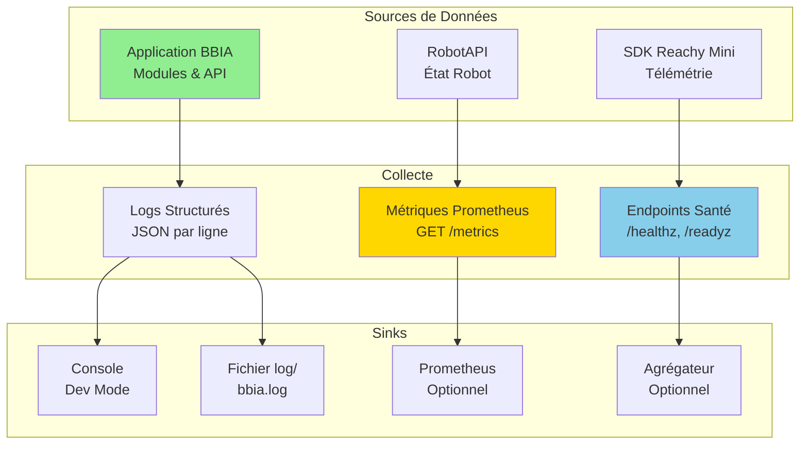
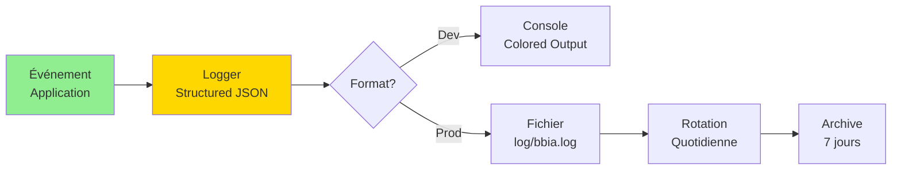
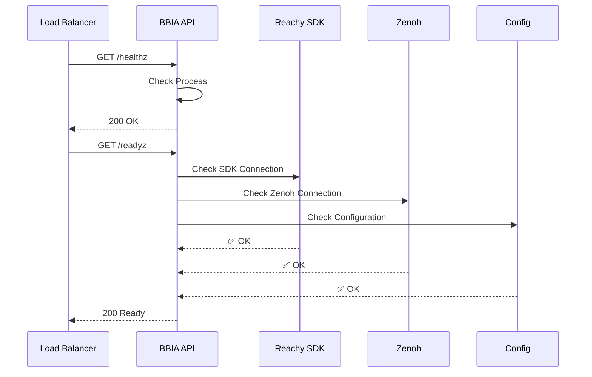
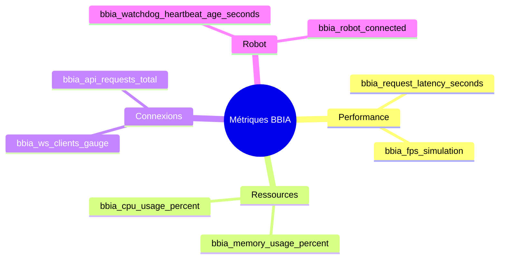

# 📊 Observabilité - Logs, Métriques, Santé

**Date** : Oct / Nov. 2025
**Version** : 1.0
**Compatibilité Python** : 3.11+

> **Liens utiles** : [`docs/reference/INDEX_THEMATIQUE.md`](../reference/INDEX_THEMATIQUE.md), [`docs/reference/project-status.md`](../reference/project-status.md)

**📊 [CI/CD Pipeline](../deployment/PIPELINE_CI.md)** | **📚 [Guide technique](../guides/GUIDE_AVANCE.md)**

---

## Architecture Observabilité

## Logs structurés (proposé)

- Format: JSON par ligne
- Champs recommandés: timestamp, level, logger, message, module, request_id
- Sinks: console (dev), fichier `log/bbia.log` (prod), agrégateur (optionnel)

### Flux Logs

## Endpoints santé (proposé)

- Liveness: `GET /healthz` → 200 si process OK
- Readiness: `GET /readyz` → 200 si dépendances OK (SDK/Zenoh/config)

### Flux Health Checks

## Métriques Prometheus ✅ **IMPLÉMENTÉ** (24 Nov. 2025)

- Exposition: `GET /metrics/prometheus` ✅
- Métriques disponibles:
  - ✅ bbia_request_latency_seconds (histogram)
  - ✅ bbia_ws_clients_gauge (active_connections)
  - ✅ bbia_cpu_usage_percent, bbia_memory_usage_bytes
  - ✅ bbia_watchdog_heartbeat_age_seconds - **NOUVEAU**
  - ✅ bbia_robot_connected - **NOUVEAU**
  - ✅ bbia_latency_p50_ms, bbia_latency_p95_ms, bbia_latency_p99_ms - **NOUVEAU**
  - ✅ bbia_simulation_fps

### Métriques Disponibles

## Intégration CI

- Vérifier `/healthz` et `/readyz` en job e2e
- Publier `coverage.xml` + rapport perf (JSONL) en artifacts

## Références

- État par axe: `docs/reference/project-status.md` → Observabilité
