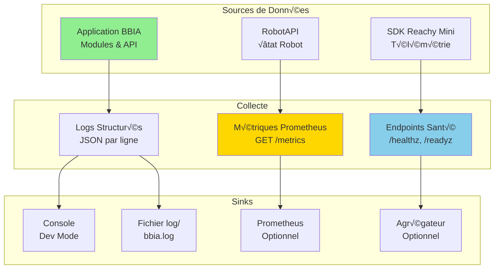
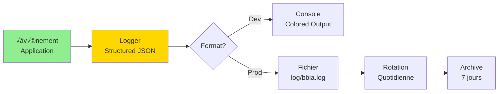
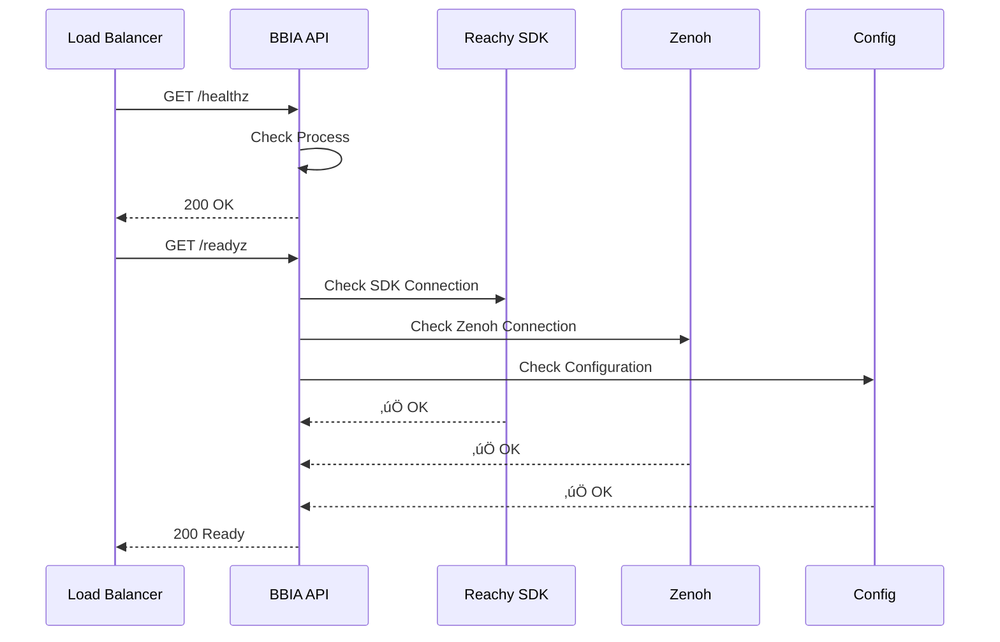
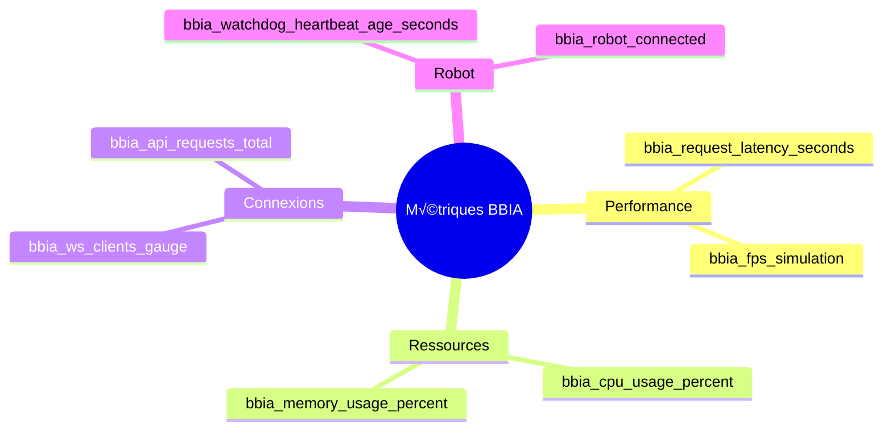

# 📊 Observabilité - Logs, Métriques, Santé

**Date** : Oct / Nov. 2025  
**Version** : 1.0  
**Compatibilité Python** : 3.11+

> **Liens utiles** : [`docs/reference/INDEX_THEMATIQUE.md`](../reference/INDEX_THEMATIQUE.md), [`docs/reference/project-status.md`](../reference/project-status.md)

**📊 [CI/CD Pipeline](../deployment/PIPELINE_CI.md)** | **📚 [Guide avancé](../guides/GUIDE_AVANCE.md)**

---

## Architecture Observabilité

```mermaid
graph TB
    subgraph "Sources de Données"
        APP[Application BBIA<br/>Modules & API]
        ROBOT[RobotAPI<br/>État Robot]
        SDK[SDK Reachy Mini<br/>Télémétrie]
    end
    
    subgraph "Collecte"
        LOGS[Logs Structurés<br/>JSON par ligne]
        METRICS[Métriques Prometheus<br/>GET /metrics]
        HEALTH[Endpoints Santé<br/>/healthz, /readyz]
    end
    
    subgraph "Sinks"
        CONSOLE[Console<br/>Dev Mode]
        FILE[Fichier log/<br/>bbia.log]
        PROMETHEUS[Prometheus<br/>Optionnel]
        AGGREGATOR[Agrégateur<br/>Optionnel]
    end
    
    APP --> LOGS
    ROBOT --> METRICS
    SDK --> HEALTH
    
    LOGS --> CONSOLE
    LOGS --> FILE
    METRICS --> PROMETHEUS
    HEALTH --> AGGREGATOR
    
    style APP fill:#90EE90
    style METRICS fill:#FFD700
    style HEALTH fill:#87CEEB
```

## Logs structurés (proposé)

- Format: JSON par ligne
- Champs recommandés: timestamp, level, logger, message, module, request_id
- Sinks: console (dev), fichier `log/bbia.log` (prod), agrégateur (optionnel)

### Flux Logs

```mermaid
flowchart LR
    EVENT[Événement<br/>Application] --> LOGGER[Logger<br/>Structured JSON]
    
    LOGGER --> FORMAT{Format?}
    FORMAT -->|Dev| CONSOLE[Console<br/>Colored Output]
    FORMAT -->|Prod| FILE[Fichier<br/>log/bbia.log]
    
    FILE --> ROTATE[Rotation<br/>Quotidienne]
    ROTATE --> ARCHIVE[Archive<br/>7 jours]
    
    style EVENT fill:#90EE90
    style LOGGER fill:#FFD700
```

## Endpoints santé (proposé)

- Liveness: `GET /healthz` ‚Üí 200 si process OK
- Readiness: `GET /readyz` → 200 si dépendances OK (SDK/Zenoh/config)

### Flux Health Checks

```mermaid
sequenceDiagram
    participant LB as Load Balancer
    participant API as BBIA API
    participant SDK as Reachy SDK
    participant ZENOH as Zenoh
    participant CONFIG as Config
    
    LB->>API: GET /healthz
    API->>API: Check Process
    API-->>LB: 200 OK
    
    LB->>API: GET /readyz
    API->>SDK: Check SDK Connection
    API->>ZENOH: Check Zenoh Connection
    API->>CONFIG: Check Configuration
    
    SDK-->>API: ‚úÖ OK
    ZENOH-->>API: ‚úÖ OK
    CONFIG-->>API: ‚úÖ OK
    
    API-->>LB: 200 Ready
```

## Métriques Prometheus (proposé)

- Exposition: `GET /metrics`
- Métriques recommandées:
  - bbia_request_latency_seconds (histogram)
  - bbia_ws_clients_gauge
  - bbia_cpu_usage_percent, bbia_memory_usage_percent
  - bbia_watchdog_heartbeat_age_seconds

### Métriques Disponibles

```mermaid
mindmap
  root((Métriques BBIA))
    Performance
      bbia_request_latency_seconds
      bbia_fps_simulation
    Ressources
      bbia_cpu_usage_percent
      bbia_memory_usage_percent
    Connexions
      bbia_ws_clients_gauge
      bbia_api_requests_total
    Robot
      bbia_watchdog_heartbeat_age_seconds
      bbia_robot_connected
```

## Intégration CI

- Vérifier `/healthz` et `/readyz` en job e2e
- Publier `coverage.xml` + rapport perf (JSONL) en artifacts

## Références

- État par axe: `docs/reference/project-status.md` → Observabilité
