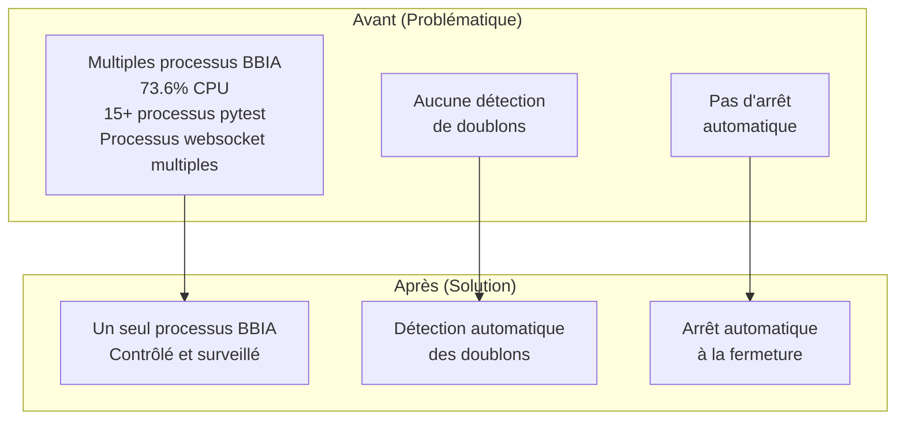
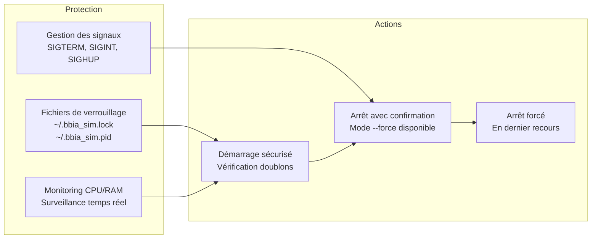
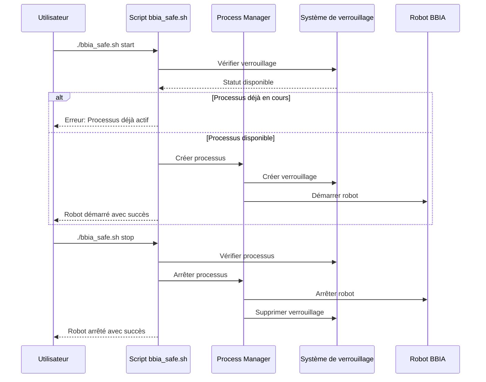

# Système de gestion sécurisée des processus BBIA

**Date** : Oct / Nov. 2025

> Compatibilité Python et CI
>
> - Python requis: 3.11+
> - CI: `.github/workflows/ci.yml`
> - Setup local:
> ```bash
> pyenv install 3.11.9 && pyenv local 3.11.9
> python -m pip install --upgrade pip
> pip install -e .
> ```

## Problème résolu

Votre Mac ramait à cause de **multiples processus BBIA** qui tournaient en arrière-plan :

- `launch_complete_robot.py` consommait **73.6% CPU**
- **15+ processus pytest** traînaient depuis l'après-midi
- **Processus websocket_integration** multiples
- **Aucun système de détection de doublons**

## Architecture du système de gestion



## Système de sécurité



## Workflow de gestion



### Utilisation

```bash
# Vérifier le statut
./scripts/bbia_safe.sh status

# Arrêt avec confirmation
./scripts/bbia_safe.sh stop

# Arrêt forcé (sans confirmation)
./scripts/bbia_safe.sh stop --force

# Tuer tous les processus (DANGEREUX)
./scripts/bbia_safe.sh kill-all

```

### Fonctionnalités de sécurité

#### 1. Détection de doublons
- vérifie si un processus BBIA est déjà en cours
- empêche le démarrage de multiples instances
- fichiers de verrouillage : `~/.bbia_sim.lock` et `~/.bbia_sim.pid`

#### 2. Arrêt automatique
- arrêt automatique quand le terminal se ferme
- gestion des signaux SIGTERM, SIGINT, SIGHUP
- nettoyage automatique des fichiers de verrouillage

#### 3. Confirmation de sécurité
- demande confirmation avant d'arrêter les processus
- mode `--force` pour les scripts automatisés
- affichage détaillé des processus avant arrêt

#### 4. Monitoring intelligent
- surveillance CPU et mémoire en temps réel
- détection automatique des processus BBIA
- statut détaillé avec PID et ressources

### Exemple de sortie

```bash
$ ./scripts/bbia_safe.sh status
📊 Statut des processus BBIA
==================================================
🔒 Processus verrouillé: PID 12345
🔍 1 processus BBIA en cours:
   🔒 VERROUILLÉ PID 12345: 2.3% CPU, 45.2MB RAM
      python3 scripts/launch_complete_robot.py --headless

```

### Protection contre les problèmes

#### Avant (problématique)

```bash
# Risqué - peut créer des doublons
python3 scripts/launch_complete_robot.py --headless

# Processus qui traînent après Ctrl+C
# Pas de détection de doublons
# Pas d'arrêt automatique

```

#### Après (sécurisé)

```bash
# Sécurisé - détection de doublons
./scripts/bbia_safe.sh start headless

# ✅ Vérification automatique des doublons
# ✅ Arrêt automatique à la fermeture du terminal
# ✅ Confirmation avant arrêt
# ✅ Monitoring des ressources

```

### Installation des dépendances

Le script installe automatiquement `psutil` si nécessaire :

```bash
# Installation automatique
pip install psutil

```

### Fichiers de configuration

- **`~/.bbia_sim.lock`** : Fichier de verrouillage principal
- **`~/.bbia_sim.pid`** : PID du processus verrouillé
- **Nettoyage automatique** : À l'arrêt

### En cas de problème

Si des processus traînent encore :

```bash
# Vérifier le statut
./scripts/bbia_safe.sh status

# Arrêt forcé
./scripts/bbia_safe.sh stop --force

# En dernier recours (DANGEREUX)
./scripts/bbia_safe.sh kill-all

```

### Recommandations

1. **Utilisez toujours** `./scripts/bbia_safe.sh` au lieu des scripts directs
2. **Vérifiez le statut** avant de démarrer : `./scripts/bbia_safe.sh status`
3. **Arrêtez proprement** : `./scripts/bbia_safe.sh stop`
4. **Évitez** `kill-all` sauf en cas d'urgence

---

## Résultat

- ✅ Plus de processus qui traînent
- ✅ Détection automatique des doublons
- ✅ Arrêt automatique à la fermeture du terminal
- ✅ Confirmation avant arrêt
- ✅ Monitoring des ressources
- ✅ Mac plus réactif

Votre Mac ne devrait plus ramer à cause des processus BBIA.

---

## 🎯 Navigation

**Retour à** : [README Documentation](../README.md)  
**Voir aussi** : [Index Thématique](../reference/INDEX_THEMATIQUE.md)
