```mermaid
graph TB
    subgraph "Avant (Problématique)"
        MULTIPLE[Multiples processus BBIA<br/>73.6% CPU<br/>15+ processus pytest<br/>Processus websocket multiples]
        NO_DETECTION[Aucune détection<br/>de doublons]
        NO_CLEANUP[Pas d'arrêt<br/>automatique]
    end

    subgraph "Après (Solution)"
        SINGLE[Un seul processus BBIA<br/>Contrôlé et surveillé]
        DETECTION[Détection automatique<br/>des doublons]
        CLEANUP[Arrêt automatique<br/>à la fermeture]
    end

    MULTIPLE --> SINGLE
    NO_DETECTION --> DETECTION
    NO_CLEANUP --> CLEANUP

```

```mermaid
graph LR
    subgraph "Protection"
        LOCK[Fichiers de verrouillage<br/>~/.bbia_sim.lock<br/>~/.bbia_sim.pid]
        MONITOR[Monitoring CPU/RAM<br/>Surveillance temps réel]
        SIGNALS[Gestion des signaux<br/>SIGTERM, SIGINT, SIGHUP]
    end

    subgraph "Actions"
        START[Démarrage sécurisé<br/>Vérification doublons]
        STOP[Arrêt avec confirmation<br/>Mode --force disponible]
        KILL[Arrêt forcé<br/>En dernier recours]
    end

    LOCK --> START
    MONITOR --> START
    SIGNALS --> STOP
    START --> STOP
    STOP --> KILL

```

```mermaid
sequenceDiagram
    participant U as Utilisateur
    participant S as Script bbia_safe.sh
    participant P as Process Manager
    participant L as Système de verrouillage
    participant R as Robot BBIA

    U->>S: ./bbia_safe.sh start
    S->>L: Vérifier verrouillage
    L-->>S: Statut disponible

    alt Processus déjà en cours
        S-->>U: Erreur: Processus déjà actif
    else Processus disponible
        S->>P: Créer processus
        P->>L: Créer verrouillage
        P->>R: Démarrer robot
        S-->>U: Robot démarré avec succès
    end

    U->>S: ./bbia_safe.sh stop
    S->>L: Vérifier processus
    S->>P: Arrêter processus
    P->>R: Arrêter robot
    P->>L: Supprimer verrouillage
    S-->>U: Robot arrêté avec succès

```

# 🔒 Système de Gestion Sécurisée des Processus BBIA

## 🎯 **Problème Résolu**

Votre Mac ramait à cause de **multiples processus BBIA** qui tournaient en arrière-plan :
- `launch_complete_robot.py` consommait **73.6% CPU**
- **15+ processus pytest** traînaient depuis l'après-midi
- **Processus websocket_integration** multiples
- **Aucun système de détection de doublons**

## 🔧 **Architecture du Système de Gestion**



## 🛡️ **Système de Sécurité**



## 🔄 **Workflow de Gestion**



# Vérifier le statut
./scripts/bbia_safe.sh status

# Arrêt avec confirmation
./scripts/bbia_safe.sh stop

# Arrêt forcé (sans confirmation)
./scripts/bbia_safe.sh stop --force

# Tuer tous les processus (DANGEREUX)
./scripts/bbia_safe.sh kill-all
```

### 🔒 **Fonctionnalités de Sécurité**

#### **1. Détection de Doublons**
- ✅ Vérifie si un processus BBIA est déjà en cours
- ✅ Empêche le démarrage de multiples instances
- ✅ Fichiers de verrouillage : `~/.bbia_sim.lock` et `~/.bbia_sim.pid`

#### **2. Arrêt Automatique**
- ✅ Arrêt automatique quand le terminal se ferme
- ✅ Gestion des signaux SIGTERM, SIGINT, SIGHUP
- ✅ Nettoyage automatique des fichiers de verrouillage

#### **3. Confirmation de Sécurité**
- ✅ Demande confirmation avant d'arrêter les processus
- ✅ Mode `--force` pour les scripts automatisés
- ✅ Affichage détaillé des processus avant arrêt

#### **4. Monitoring Intelligent**
- ✅ Surveillance CPU et mémoire en temps réel
- ✅ Détection automatique des processus BBIA
- ✅ Statut détaillé avec PID et ressources

### 📊 **Exemple de Sortie**

```bash
$ ./scripts/bbia_safe.sh status
📊 Statut des processus BBIA
==================================================
🔒 Processus verrouillé: PID 12345
🔍 1 processus BBIA en cours:
   🔒 VERROUILLÉ PID 12345: 2.3% CPU, 45.2MB RAM
      python3 scripts/launch_complete_robot.py --headless
```

### 🛡️ **Protection Contre les Problèmes**

#### **Avant (Problématique)**
```bash
# Risqué - peut créer des doublons
python3 scripts/launch_complete_robot.py --headless

# Processus qui traînent après Ctrl+C
# Pas de détection de doublons
# Pas d'arrêt automatique
```

#### **Après (Sécurisé)**
```bash
# Sécurisé - détection de doublons
./scripts/bbia_safe.sh start headless

# ✅ Vérification automatique des doublons
# ✅ Arrêt automatique à la fermeture du terminal
# ✅ Confirmation avant arrêt
# ✅ Monitoring des ressources
```

### 🔧 **Installation des Dépendances**

Le script installe automatiquement `psutil` si nécessaire :

```bash
# Installation automatique
pip install psutil
```

### 📝 **Fichiers de Configuration**

- **`~/.bbia_sim.lock`** - Fichier de verrouillage principal
- **`~/.bbia_sim.pid`** - PID du processus verrouillé
- **Nettoyage automatique** à l'arrêt

### 🚨 **En Cas de Problème**

Si des processus traînent encore :

```bash
# Vérifier le statut
./scripts/bbia_safe.sh status

# Arrêt forcé
./scripts/bbia_safe.sh stop --force

# En dernier recours (DANGEREUX)
./scripts/bbia_safe.sh kill-all
```

### 💡 **Recommandations**

1. **Utilisez toujours** `./scripts/bbia_safe.sh` au lieu des scripts directs
2. **Vérifiez le statut** avant de démarrer : `./scripts/bbia_safe.sh status`
3. **Arrêtez proprement** : `./scripts/bbia_safe.sh stop`
4. **Évitez** `kill-all` sauf en cas d'urgence

## 🎯 **Résultat**

✅ **Plus de processus qui traînent**  
✅ **Détection automatique des doublons**  
✅ **Arrêt automatique à la fermeture du terminal**  
✅ **Confirmation avant arrêt**  
✅ **Monitoring des ressources**  
✅ **Mac plus réactif**  

Votre Mac ne devrait plus ramer à cause des processus BBIA ! 🚀
