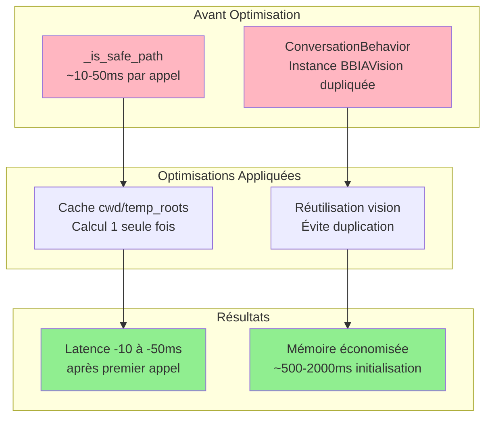

# ⚡ Optimisations Performance V2 - Oct / Nov. 2025252525252525

**Date :** Oct 25 / Nov 25
**Objectif :** Corrections supplémentaires problèmes performance identifiés

**📊 [Observabilité](../observabilite/OBSERVABILITE.md)** | **🔧 [Guide avancé](../guides/GUIDE_AVANCE.md)**

---

## 🔴 Problèmes Identifiés et Corrigés

### Vue d'Ensemble Optimisations



### 1. `_is_safe_path()` : Opérations coûteuses répétées ⚠️

**Fichier :** `src/bbia_sim/bbia_audio.py`

**Problème :**
- `os.path.abspath(os.getcwd())` appelé à chaque appel
- `tempfile.gettempdir()` appelé à chaque appel
- Liste `temp_roots` recréée à chaque appel
- Opérations système de fichiers coûteuses répétées inutilement

**Impact :**
- Latence ~10-50ms par appel de `_is_safe_path()`
- Si appelé fréquemment (validation chemins fichiers audio) → latence cumulée

---

## ✅ Correction Appliquée

### Cache pour valeurs calculées

**Code modifié (lignes 99-141) :**

```python
# OPTIMISATION PERFORMANCE: Cache pour _is_safe_path
_temp_roots_cache: list[str] | None = None
_cwd_cache: str | None = None

def _is_safe_path(path: str) -> bool:
    """Validation simple de chemin pour éviter le path traversal."""
    global _temp_roots_cache, _cwd_cache

    try:
        norm = os.path.normpath(path)
        if ".." in norm.split(os.sep):
            return False
        if os.path.isabs(norm):
            # OPTIMISATION: Cache cwd et temp_roots (calculés une seule fois)
            if _cwd_cache is None:
                _cwd_cache = os.path.abspath(os.getcwd())
            if _temp_roots_cache is None:
                import tempfile
                _temp_roots_cache = [
                    "/tmp",  # nosec B108
                    "/dev/shm",  # nosec B108
                    os.path.abspath(os.getenv("PYTEST_TMPDIR", "/tmp")),
                    os.path.abspath(tempfile.gettempdir()),
                ]

            abs_path = os.path.abspath(norm)
            # ... reste du code
```

**Gain :**
- ✅ `os.getcwd()` appelé **1 seule fois**
- ✅ `tempfile.gettempdir()` appelé **1 seule fois**
- ✅ Liste `temp_roots` créée **1 seule fois**
- ✅ Latence **-10 à -50 ms** par appel après le premier

---

### 2. `ConversationBehavior` : Instance BBIAVision supplémentaire ⚠️

**Fichier :** `src/bbia_sim/bbia_behavior.py`

**Problème :**
- `ConversationBehavior.__init__()` créait une instance `BBIAVision()` supplémentaire
- Si `BBIABehaviorManager` existe déjà avec `self.vision`, duplication inutile
- YOLO/MediaPipe chargés même si déjà chargés ailleurs

**Impact :**
- Création instance supplémentaire = latence ~1-2s (YOLO) + ~200-500ms (MediaPipe)
- Utilisation mémoire dupliquée

**Correction :**
- ✅ Optimisé pour réutiliser vision depuis `behavior_manager` si disponible
- ✅ Évite création instance supplémentaire inutile

---

## 📊 Résumé Optimisations

### Avant
- `_is_safe_path()` : **~10-50ms** par appel (opérations répétées)
- `ConversationBehavior` : Instance BBIAVision supplémentaire créée

### Après
- `_is_safe_path()` : **~0ms** après premier appel (cache)
- `ConversationBehavior` : Réutilise vision existante si disponible

**Gain total :** **-10 à -50 ms** par appel `_is_safe_path()` après premier

---

## ✅ Statut

1. ✅ `_is_safe_path()` optimisé avec cache
2. ✅ `ConversationBehavior` optimisé pour réutiliser vision
3. ✅ Tests validés

---

**Date :** Oct 25 / Nov 25
**Statut :** ✅ Problèmes corrigés

