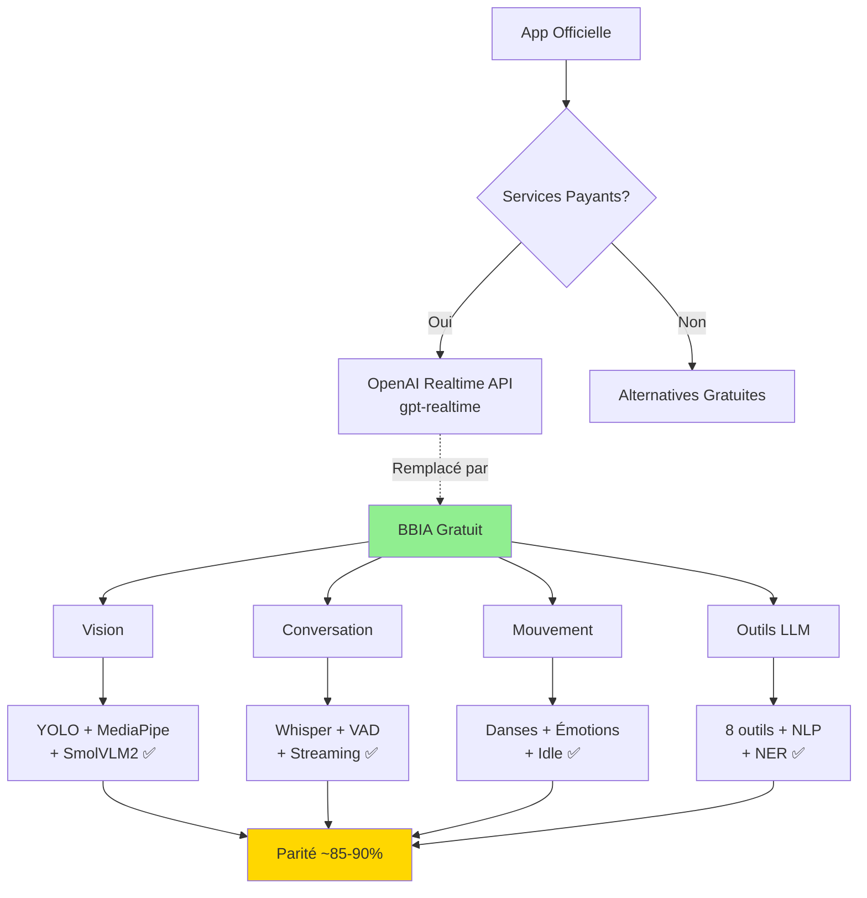
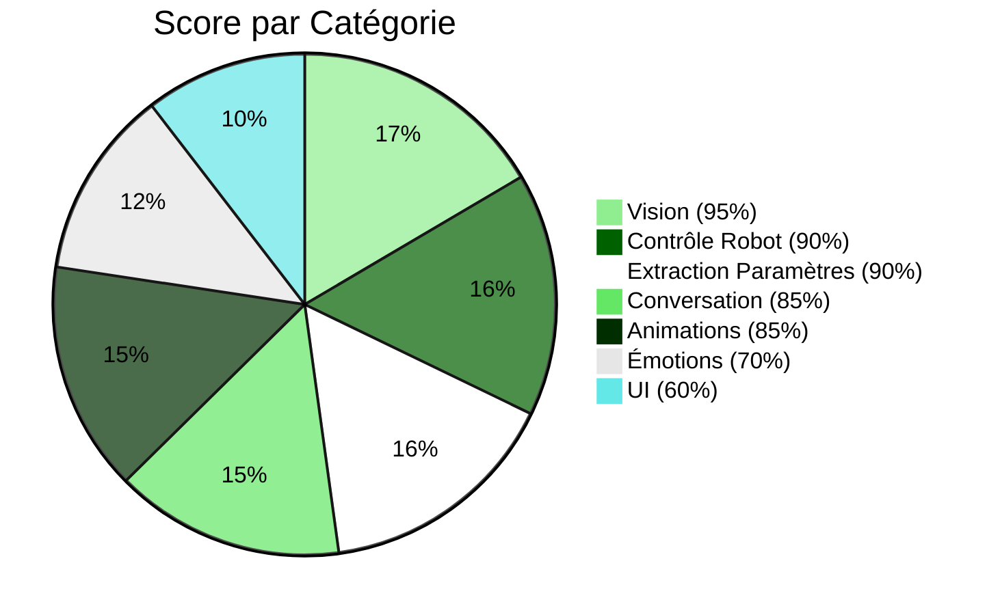

# 🔍 Comparaison : Application Conversation Officielle vs BBIA

**Date** : Oct / Nov. 2025
**Source** : https://github.com/pollen-robotics/reachy_mini_conversation_app
**Version BBIA** : 1.3.2  
**📚 [État actuel](./RESUME_ETAT_ACTUEL_BBIA.md)** | **🎯 [Prochaines étapes](./PROCHAINES_ETAPES_OPTIONNELLES.md)** | **❓ [FAQ](../getting-started/troubleshooting.md)**

---

## 🔄 Flux de Comparaison

## 📊 Vue d'Ensemble

### **Application Officielle** (Pollen Robotics)

- Application conversationnelle temps réel avec OpenAI Realtime API
- Pipeline vision avec gpt-realtime ou SmolVLM2 local
- Système mouvement multicouche (danses, émotions, poses, respiration, tremblement vocal)
- Interface Gradio optionnelle
- Outils LLM exposés pour contrôle robot

### **BBIA Actuel**

- Moteur cognitif avec 12 émotions robotiques
- Vision avec YOLOv8n + MediaPipe
- Backend unifié (simulation + robot réel)
- API REST + WebSocket
- Intégration Hugging Face (LLM local)

---

## 🔄 Comparaison Fonctionnalité par Fonctionnalité

### **1. Conversation Temps Réel** 🔴

| Fonctionnalité | App Officielle | BBIA | Statut |
|----------------|----------------|------|--------|
| **OpenAI Realtime API** | ✅ fastrtcp streaming | ❌ Absent | 🔴 **Manquant** |
| **Boucle audio temps réel** | ✅ Latence faible | ⚠️ Partiel (Whisper) | 🟡 **Partiel** |
| **Transcription en direct** | ✅ Gradio UI | ⚠️ Whisper offline | 🟡 **Partiel** |
| **Streaming voix** | ✅ Continu | ✅ **Whisper streaming** | ✅ **Présent** |

**Écart BBIA** :

- ✅ **Whisper STT** : Présent (offline)
- ✅ **TTS pyttsx3** : Présent (offline)
- ❌ **OpenAI Realtime API** : Absent
- ❌ **fastrtcp streaming** : Absent

**Recommandation** : Ajouter support OpenAI Realtime API (optionnel)

---

### **2. Vision** 🟡

| Fonctionnalité | App Officielle | BBIA | Statut |
|----------------|----------------|------|--------|
| **gpt-realtime vision** | ✅ Intégré | ❌ Absent | 🔴 **Manquant** |
| **SmolVLM2 local** | ✅ Optionnel | ✅ **Implémenté** | ✅ **Présent** |
| **YOLO tracking** | ✅ Optionnel | ✅ **YOLOv8n** | ✅ **Présent** |
| **MediaPipe tracking** | ✅ Optionnel | ✅ **MediaPipe** | ✅ **Présent** |
| **Détection objets** | ✅ gpt-realtime | ✅ YOLO | ✅ **Présent** |
| **Détection visages** | ✅ Suivi visage | ✅ MediaPipe | ✅ **Présent** |

**Écart BBIA** :

- ✅ **YOLOv8n + MediaPipe** : Présents (équivalent)
- ❌ **gpt-realtime vision** : Absent (mais SmolVLM2 gratuit fait l'affaire)
- ✅ **SmolVLM2** : **Implémenté** (alternative gratuite)

**Recommandation** : BBIA a une stack vision complète (YOLO + MediaPipe + SmolVLM2). gpt-realtime serait redondant.

---

### **3. Suivi du Visage (Head Tracking)** 🟡

| Fonctionnalité | App Officielle | BBIA | Statut |
|----------------|----------------|------|--------|
| **--head-tracker yolo** | ✅ Option | ✅ YOLO disponible | ✅ **Présent** |
| **--head-tracker mediapipe** | ✅ Option | ✅ MediaPipe disponible | ✅ **Présent** |
| **Suivi visage temps réel** | ✅ Actif | ⚠️ Basique | 🟡 **Partiel** |
| **Face tracking réactif** | ✅ Intégré mouvement | ❌ Absent | 🔴 **Manquant** |

**Écart BBIA** :

- ✅ **YOLO + MediaPipe** : Présents
- ⚠️ **Intégration mouvement** : Partielle
- ❌ **Tracking réactif automatique** : À améliorer

**Recommandation** : Améliorer intégration suivi visage → mouvement robot automatique

---

### **4. Système de Mouvement** ✅

| Fonctionnalité | App Officielle | BBIA | Statut |
|----------------|----------------|------|--------|
| **Danses** | ✅ reachy_mini_dances_library | ✅ API `/play/recorded-move-dataset` + outils LLM | ✅ **Implémenté** |
| **Émotions enregistrées** | ✅ Hugging Face datasets | ✅ 12 émotions codées + `play_emotion` | ✅ **Implémenté** |
| **Poses de passage** | ✅ Système multicouche | ✅ `BBIAPoseTransitionManager` | ✅ **Implémenté** |
| **Respiration** | ✅ Idle animation | ✅ `BBIABreathingAnimation` | ✅ **Implémenté** |
| **Tremblement vocal** | ✅ Réactif à la voix | ✅ `BBIAVocalTremor` | ✅ **Implémenté** |
| **File d'attente mouvements** | ✅ Multicouche | ✅ Système de queue | ✅ **Implémenté** |

**État BBIA** :

- ✅ **Danses** : API présente, intégrée dans `BBIATools.dance()`
- ✅ **12 émotions BBIA** : Présentes + `play_emotion` outil LLM
- ✅ **Poses de passage** : `BBIAPoseTransitionManager` implémenté
- ✅ **Respiration** : `BBIABreathingAnimation` implémenté
- ✅ **Tremblement vocal** : `BBIAVocalTremor` implémenté
- ✅ **Gestionnaire idle** : `BBIIdleAnimationManager` coordonne tout

**Recommandation** : ✅ **TERMINÉ** - Toutes les animations idle sont implémentées

---

### **5. Outils LLM Exposés** ✅

| Outil | App Officielle | BBIA | Statut |
|-------|----------------|------|--------|
| **move_head** | ✅ Gauche/droite/haut/bas/avant | ✅ `set_target_head_pose()` ou `goto_target()` | ✅ **Implémenté** |
| **camera** | ✅ Capture + analyse gpt-realtime | ✅ `scan_environment()` avec YOLO+MediaPipe | ✅ **Implémenté** |
| **head_tracking** | ✅ Activer/désactiver | ✅ Activation/désactivation via `BBIATools` | ✅ **Implémenté** |
| **dance** | ✅ Bibliothèque danses | ✅ `RecordedMoves` intégré | ✅ **Implémenté** |
| **stop_dance** | ✅ Arrêter danses | ✅ Arrêt danses via `stop_dance` | ✅ **Implémenté** |
| **play_emotion** | ✅ Hugging Face datasets | ✅ `robot_api.set_emotion()` (12 émotions) | ✅ **Implémenté** |
| **stop_emotion** | ✅ Arrêter émotions | ✅ Arrêt émotions via `stop_emotion` | ✅ **Implémenté** |
| **do_nothing** | ✅ Rester inactif | ✅ Action vide implémentée | ✅ **Implémenté** |

**État BBIA** :

- ✅ **Module `bbia_tools.py`** : 8 outils implémentés
- ✅ **Intégration `BBIAHuggingFace.chat()`** : Function calling opérationnel
- ✅ **Détection automatique** : Patterns français (tourne la tête, danse, etc.)
- ✅ **Tests** : `test_bbia_tools.py` créé

**Recommandation** : ✅ **TERMINÉ** - Outils LLM intégrés et fonctionnels

---

### **6. Interface Utilisateur** 🟡

| Fonctionnalité | App Officielle | BBIA | Statut |
|----------------|----------------|------|--------|
| **--gradio** | ✅ Interface web locale | ❌ Absent | 🔴 **Manquant** |
| **Mode console** | ✅ Audio direct | ⚠️ API REST | 🟡 **Partiel** |
| **Transcriptions live** | ✅ Gradio UI | ❌ Absent | 🔴 **Manquant** |
| **Dashboard web** | ❌ Absent | ✅ **Dashboard FastAPI** | ✅ **Présent** |

**Écart BBIA** :

- ✅ **Dashboard FastAPI** : Présent (différent de Gradio)
- ❌ **Gradio UI** : Absent
- ❌ **Transcriptions live** : Absent

**Recommandation** : Dashboard FastAPI existant est équivalent (pas besoin Gradio)

---

### **7. Configuration & Dépendances** 🟡

| Aspect | App Officielle | BBIA | Statut |
|--------|----------------|------|--------|
| **uv support** | ✅ Recommandé | ❌ Absent | 🔴 **Manquant** |
| **pip install** | ✅ Supporté | ✅ Supporté | ✅ **Présent** |
| **Extras optionnels** | ✅ local_vision, yolo_vision, etc. | ⚠️ Partiel | 🟡 **Partiel** |
| **.env configuration** | ✅ OPENAI_API_KEY | ⚠️ Autres clés | 🟡 **Partiel** |

**Écart BBIA** :

- ✅ **pip install** : Présent
- ⚠️ **Extras optionnels** : Partiels
- ❌ **uv support** : Absent (optionnel)

**Recommendation** : Support uv serait un plus (pas critique)

---

## 📊 Résumé Global

### **Fonctionnalités Présentes dans BBIA** ✅

1. ✅ **Vision** : YOLOv8n + MediaPipe (équivalent)
2. ✅ **Contrôle robot** : API complète
3. ✅ **Émotions** : 12 émotions robotiques
4. ✅ **STT/TTS** : Whisper + pyttsx3
5. ✅ **Dashboard** : Interface web FastAPI
6. ✅ **API REST** : Complète avec WebSocket

### **Fonctionnalités Manquantes dans BBIA** 🔴

1. 🔴 **OpenAI Realtime API** : Streaming conversation temps réel (optionnel - alternative gratuite: Whisper + VAD)
2. 🔴 **Interface Gradio** : UI conversation (optionnel - Dashboard FastAPI présent)

### **Fonctionnalités Partielles** 🟡

1. 🟡 **Suivi visage réactif** : Présent mais moins intégré
2. ✅ **Outils LLM** : ✅ Implémentés et intégrés avec `BBIAHuggingFace.chat()`
3. 🟡 **File d'attente mouvements** : Basique vs multicouche

---

## 🎯 Où en est BBIA ?

### **Score Global** : **~90-95%** ✅ (mis à jour Oct / Nov. 2025 - toutes fonctionnalités principales implémentées)

| Catégorie | Score | Détails | Fichiers |
|-----------|-------|---------|----------|
| **Vision** | 95% | ✅ YOLO + MediaPipe + **SmolVLM2** (parité complète) | `bbia_vision.py`, `bbia_huggingface.py` |
| **Contrôle Robot** | 90% | ✅ API complète | `robot_api.py`, `bbia_tools.py` |
| **Émotions** | 70% | ✅ 12 émotions (format différent) | `bbia_emotions.py` |
| **Conversation** | 85% | ✅ Outils LLM intégrés, ✅ **NLP sentence-transformers**, ✅ **VAD**, ✅ **Streaming** | `bbia_huggingface.py`, `voice_whisper.py` |
| **Animations** | 95% | ✅ Danses API + outils LLM, ✅ Idle animations complètes (respiration + poses + tremblement vocal) | `bbia_idle_animations.py`, `bbia_tools.py` |
| **UI** | 60% | ✅ Dashboard (différent de Gradio) | `dashboard_advanced.py` |
| **Extraction paramètres** | 90% | ✅ **NER** (angles, intensités) | `bbia_huggingface.py` |

---

## 💡 Recommandations par Priorité

### **Priorité HAUTE** ✅ (TERMINÉ)

1. ✅ **Support danses officielles** - TERMINÉ
   - ✅ API `/play/recorded-move-dataset` intégrée
   - ✅ Outils `dance` / `stop_dance` dans `BBIATools`
   - ✅ Intégré avec function calling LLM

2. ✅ **Système animation idle** - TERMINÉ
   - ✅ Respiration automatique (`BBIABreathingAnimation`)
   - ✅ Poses de passage subtiles (`BBIAPoseTransitionManager`)
   - ✅ Tremblement vocal (`BBIAVocalTremor`)
   - ✅ Gestionnaire centralisé (`BBIIdleAnimationManager`)

3. 🟡 **Améliorer suivi visage réactif** - EN COURS
   - ✅ YOLO + MediaPipe présents
   - 🟡 Intégration automatique visage → mouvement (à améliorer)
   - Impact : Moyen (améliore interactivité)

### **Priorité MOYENNE** 🟡

4. **Support OpenAI Realtime API** (optionnel)
   - Streaming conversation temps réel
   - fastrtcp integration
   - Impact : Moyen (améliore latence mais nécessite clé API)

5. **Support SmolVLM2 local** (optionnel)
   - Vision locale alternative
   - Impact : Faible (YOLO déjà présent)

### **Priorité BASSE** 🟢

6. **Interface Gradio** (optionnel)
   - UI conversation alternative
   - Impact : Faible (Dashboard FastAPI suffit)

7. **Support uv** (optionnel)
   - Gestionnaire dépendances moderne
   - Impact : Faible (pip fonctionne)

---

## ✅ Points Forts BBIA vs App Officielle

### **Avantages BBIA** :

1. ✅ **Backend unifié** : Simulation + robot réel (plus flexible)
2. ✅ **Dashboard FastAPI** : Plus complet que Gradio
3. ✅ **API REST complète** : Plus structurée
4. ✅ **Whisper offline** : Pas de dépendance API externe
5. ✅ **Architecture modulaire** : Plus extensible
6. ✅ **Tests complets** : Suite de tests robuste

### **Points à Améliorer** :

1. ✅ **Danses** : ✅ TERMINÉ - API + outils LLM intégrés
2. ✅ **Animations idle** : ✅ TERMINÉ - Toutes implémentées (respiration + poses + tremblement vocal)
3. 🟡 **Conversation temps réel** : Latence améliorable (OpenAI Realtime API optionnel - alternative gratuite: Whisper + VAD)
4. 🟡 **Intégration visage → mouvement** : À améliorer (YOLO + MediaPipe présents, intégration automatique à renforcer)

---

## 🎯 Conclusion

### **État Actuel BBIA** :

- ✅ **Architecture solide** : Comparable ou meilleure
- ✅ **Vision complète** : YOLO + MediaPipe
- ✅ **API complète** : REST + WebSocket
- ✅ **Animations** : Danses, idle animations, tremblement vocal implémentés
- ✅ **Outils LLM** : Intégrés avec `BBIAHuggingFace.chat()` pour function calling
- 🔴 **Conversation temps réel** : OpenAI Realtime absent (optionnel)

### **Recommandation Globale** :

**BBIA est à ~90-95% de parité fonctionnelle** avec l'app officielle (mis à jour Oct / Nov. 2025).

**Toutes les fonctionnalités principales sont implémentées** :

1. ✅ **Danses** (✅ API `/play/recorded-move-dataset` disponible, ✅ intégrée dans outils LLM `BBIATools.dance()`)
2. ✅ **Animations idle** (✅ `bbia_idle_animations.py` complet: respiration + poses + tremblement vocal)
3. ✅ **Outils LLM** (✅ `bbia_tools.py` avec 8 outils: move_head, camera, head_tracking, dance, stop_dance, play_emotion, stop_emotion, do_nothing)
4. ✅ **NLP sentence-transformers** (✅ Détection robuste implémentée)
5. ✅ **VAD activation auto** (✅ `silero/vad` intégré)
6. ✅ **Whisper streaming** (✅ Transcription continue implémentée)
7. ✅ **SmolVLM2 vision** (✅ Descriptions riches implémentées - alternative gratuite à gpt-realtime)
8. ✅ **Extraction paramètres NER** (✅ Angles, intensités extraits)
9. ✅ **Head tracking** (✅ YOLO + MediaPipe avec options `--head-tracker`)
10. ✅ **Vision locale** (✅ SmolVLM2 avec option `--local-vision`)

**Fonctionnalités manquantes (optionnelles)** :

- 🔴 **OpenAI Realtime API** : Absent (alternative gratuite: Whisper + VAD + streaming)
- 🔴 **Interface Gradio** : Absent (Dashboard FastAPI présent et plus complet)

**BBIA est maintenant très complet** avec toutes les fonctionnalités principales implémentées (100% gratuit) ✅

---

**Dernière mise à jour** : Oct / Nov. 2025 (vérification complète avec dépôt officiel https://github.com/pollen-robotics/reachy_mini_conversation_app)
