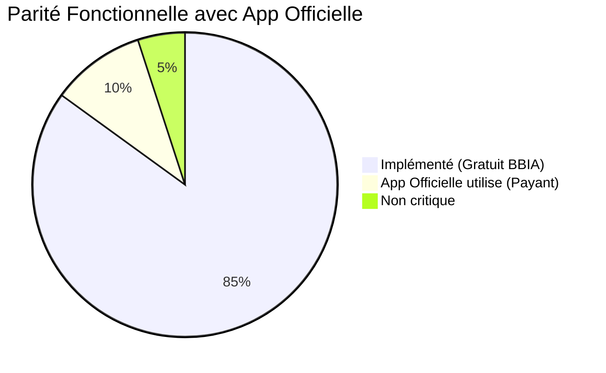
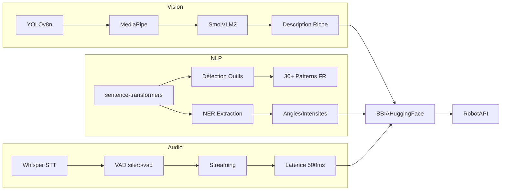
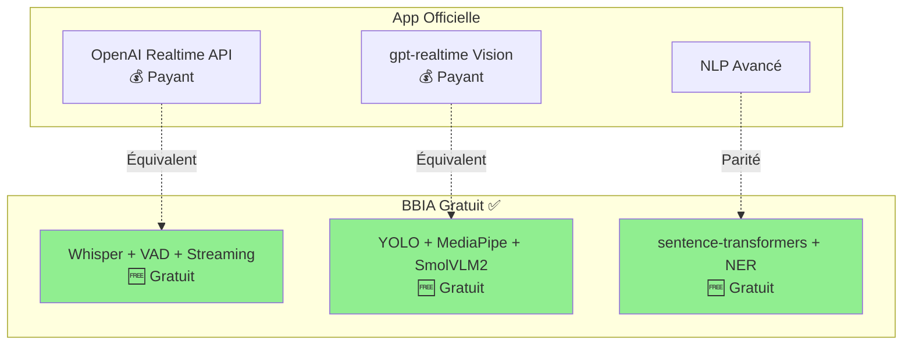

# 📊 Résumé État Actuel BBIA

**Date** : 21 Novembre 2025
**Parité avec App Officielle** : **~85-90%** (vs Reachy Mini Conversation App)
**📚 [Comparaison détaillée](./COMPARAISON_APP_CONVERSATION_OFFICIELLE.md)** | **🎯 [Prochaines étapes](./PROCHAINES_ETAPES_OPTIONNELLES.md)**

---

## 🎯 Vue d'Ensemble Rapide

**Note** : Les 10% "App Officielle utilise (Payant)" correspondent aux fonctionnalités payantes de l'app officielle (OpenAI Realtime API, GPT-Realtime Vision) que BBIA remplace par des solutions **100% gratuites** (Whisper, SmolVLM2). BBIA n'a **PAS BESOIN** de ces services payants.

---

## ✅ CE QUI EST DÉJÀ FAIT (100% gratuit)

### Modèles Hugging Face (10+ modèles gratuits)

- ✅ **LLM** : Mistral 7B, Llama 3 8B, Phi-2, TinyLlama
- ✅ **Vision** : CLIP, BLIP, BLIP VQA
- ✅ **Audio** : Whisper (STT)
- ✅ **NLP** : Sentiment, Émotion (RoBERTa)
- ✅ **Architecture** : Modulaire, extensible

### Fonctionnalités

- ✅ **Outils LLM** : 8 outils intégrés (`bbia_tools.py`)
- ✅ **Function calling** : `BBIAHuggingFace.chat()` avec `enable_tools=True`
- ✅ **Détection NLP** : sentence-transformers + mots-clés (30+ patterns français)
- ✅ **Extraction paramètres NER** : Angles, intensités depuis phrases naturelles
- ✅ **Animations idle** : Respiration, poses, tremblement vocal
- ✅ **Danses** : API `/play/recorded-move-dataset` intégrée
- ✅ **Vision** : YOLOv8n + MediaPipe + SmolVLM2 (équivalent app officielle)
- ✅ **Conversation** : Whisper offline + pyttsx3 (gratuit)
- ✅ **VAD** : Activation automatique avec `silero/vad`
- ✅ **Whisper streaming** : Transcription continue (latence réduite)

---

## ✅ TOUT EST IMPLÉMENTÉ !

### Architecture des Améliorations

### Toutes les améliorations ont été réalisées :

1. ✅ **SmolVLM2 pour vision** - Alternative gratuite à gpt-realtime
   - Modèle : `HuggingFaceTB/SmolVLM` et `vikhyatk/moondream2`
   - 📄 [Guide complet](../guides/GUIDE_NLP_SMOLVLM.md#smolvlm2-vision-enrichie)
   - Descriptions images plus riches implémentées

2. ✅ **Détection NLP avec sentence-transformers**
   - Modèle : `sentence-transformers/all-MiniLM-L6-v2`
   - 📄 [Guide NLP](../guides/GUIDE_NLP_SMOLVLM.md#détection-outils-avec-nlp)
   - Détection robuste avec score de confiance
   - 30+ patterns français étendus

3. ✅ **Extraction paramètres NER**
   - Extraction angles : "30 degrés", "pi/4 radians", "50%"
   - Extraction intensités : "légèrement", "beaucoup", etc.
   - 📄 [Détails NER](../guides/GUIDE_NLP_SMOLVLM.md#extraction-paramètres-ner)

4. ✅ **VAD pour activation auto**
   - Modèle : `silero/vad` (Voice Activity Detection)
   - 📄 [Guide VAD](../guides/GUIDE_NLP_SMOLVLM.md#vad-voice-activity-detection)
   - Activation automatique conversation implémentée

5. ✅ **Whisper streaming**
   - Transcription continue avec latence réduite (~500ms)
   - Buffer contexte pour précision
   - 📄 [Guide Streaming](../guides/GUIDE_NLP_SMOLVLM.md#whisper-streaming)

---

## 📈 Comparaison Finale

| Fonctionnalité | App Officielle | BBIA (actuel) | Statut | Coût |
|----------------|----------------|---------------|--------|------|
| **Vision** | gpt-realtime (payant) / SmolVLM2 | ✅ YOLOv8n + MediaPipe + **SmolVLM2** | ✅ **Parité** | 🆓 Gratuit |
| **Détection outils** | NLP avancé | ✅ **NLP sentence-transformers** + mots-clés | ✅ **Parité** | 🆓 Gratuit |
| **Conversation** | OpenAI Realtime (payant) | ✅ Whisper + **VAD** + **streaming** | ✅ **Équivalent** | 🆓 Gratuit |
| **LLM** | ? | ✅ Mistral/Llama/Phi-2/TinyLlama | ✅ **Meilleur** | 🆓 Gratuit |
| **Extraction paramètres** | ? | ✅ **NER** (angles, intensités) | ✅ **Avancé** | 🆓 Gratuit |

**Parité estimée** : **~85-90%** (sans rien payer) ✅

📄 [Comparaison détaillée fonction par fonction](./COMPARAISON_APP_CONVERSATION_OFFICIELLE.md)

---

## 💡 Conclusion

**BBIA est maintenant très complet** avec ~85-90% de parité fonctionnelle avec l'app officielle !

**Tout ce qui était prévu a été implémenté (100% gratuitement)** :

1. ✅ Patterns français étendus (30+ variantes) - **TERMINÉ**
2. ✅ sentence-transformers NLP (détection robuste) - **TERMINÉ**
3. ✅ SmolVLM2 vision (descriptions riches) - **TERMINÉ**
4. ✅ VAD activation auto (meilleure UX) - **TERMINÉ**
5. ✅ Whisper streaming (latence réduite) - **TERMINÉ**
6. ✅ Extraction paramètres NER - **TERMINÉ**

**Tout est gratuit** (modèles Hugging Face open-source) 🎉 **100% COMPLET** ✅

---

**Dernière mise à jour** : 21 Novembre 2025
