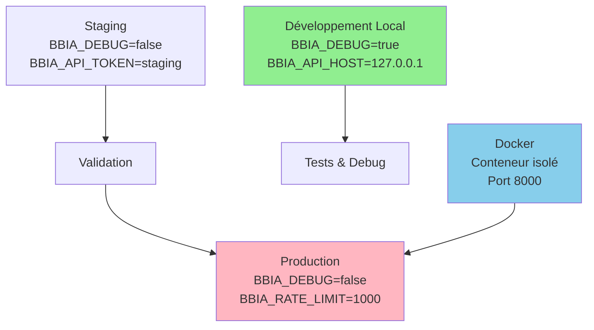

# 🌐 Configuration communautaire BBIA-SIM

> Référence état global
>
> Voir `docs/reference/project-status.md` → "Communauté" pour les templates d’issues/discussions, roadmap publique et "good first issues".

**Version** : 1.3.2 "Écosystème Ouvert"
**Date** : 21 novembre 2025
**Public** : Communauté Technique

## 🎯 **Configuration recommandée**

> **💡 Note** : Pour l'installation complète, voir [INSTALLATION.md](../getting-started/INSTALLATION.md).  
> Pour les métriques du projet, voir [METRICS.md](METRICS.md).

### **Variables d'environnement**

#### **Développement**

```bash
export BBIA_API_HOST=127.0.0.1
export BBIA_API_PORT=8000
export BBIA_LOG_LEVEL=info
export MUJOCO_GL=egl
```

#### **Production**

```bash
export BBIA_API_HOST=0.0.0.0
export BBIA_API_PORT=8000
export BBIA_LOG_LEVEL=warning
export BBIA_API_TOKEN=your_secret_token
export BBIA_RATE_LIMIT=100
export MUJOCO_GL=egl
```

---

## 🔧 **Scripts de démarrage**

### **Développement**

```bash
# Démarrage API avec rechargement automatique
python -m bbia_sim.daemon.app --reload

# Démarrage avec logs détaillés
uvicorn src.bbia_sim.daemon.app.main:app --reload --log-level debug

# Démarrage sur port personnalisé
uvicorn src.bbia_sim.daemon.app.main:app --reload --port 3000

```

### **Production**

```bash
# Démarrage production avec workers multiples
uvicorn src.bbia_sim.daemon.app.main:app --host 0.0.0.0 --port 8000 --workers 4

# Démarrage avec configuration personnalisée
uvicorn src.bbia_sim.daemon.app.main:app --host 0.0.0.0 --port 8000 --workers 2

```

### **Docker**

```bash
# Build de l'image
docker build -t bbia-sim .

# Démarrage du conteneur
docker run -p 8000:8000 bbia-sim

# Démarrage avec variables d'environnement
docker run -p 8000:8000 -e BBIA_API_TOKEN=secret bbia-sim

```

---

## Tests et validation

### **Tests automatisés**

```bash
# Tests complets de l'API
pytest tests/ -v

# Tests avec logs détaillés
pytest tests/ -v --log-level debug

# Tests sur URL personnalisée
python scripts/test_public_api.py --url http://localhost:3000

```

### **Démonstrations**

```bash
# Démonstration complète
python scripts/demo_public_api.py

# Mode démo spécifique
python scripts/demo_mode_complete.py --mode simulation
python scripts/demo_mode_complete.py --mode robot_real
python scripts/demo_mode_complete.py --mode mixed

```

### **Tests de conformité**

```bash
# Test conformité SDK officiel
python scripts/conformity/test_conformity_sdk_officiel.py

# Test hardware dry-run
python scripts/hardware_dry_run_reachy_mini.py --duration 30

# Tests de performance
python -m pytest tests/test_performance.py -v

```

---

## 📊 **Monitoring et logs**

### **Configuration des logs**

```python
# Configuration logging personnalisée
import logging

logging.basicConfig(
    level=logging.INFO,
    format="%(asctime)s - %(name)s - %(levelname)s - %(message)s",
    handlers=[
        logging.FileHandler("log/bbia.log"),
        logging.StreamHandler()
    ]
)

```

### **Métriques de performance**

```bash
# Monitoring des performances
python scripts/monitor_performance.py

# Analyse des logs
python scripts/analyze_logs.py --input log/bbia.log

# Rapport de santé
python scripts/health_report.py

```

---

## 🔐 **Sécurité**

### **Authentification**

```bash
# Génération de token sécurisé
python scripts/generate_token.py

# Configuration de l'authentification
export BBIA_API_TOKEN=$(python scripts/generate_token.py)

```

### **Configuration CORS**

```python
# Configuration CORS personnalisée
CORS_ORIGINS = [
    "http://localhost:3000",
    "http://localhost:8080",
    "https://yourdomain.com"
]

```

### **Rate limiting**

```python
# Configuration rate limiting
RATE_LIMIT_REQUESTS = 100  # requêtes par minute
RATE_LIMIT_WINDOW = 60     # fenêtre en secondes

```

---

## Intégration multi-environnements

### Vue d'ensemble des environnements



### Développement local

```bash
# Configuration développement
export BBIA_ENV=development
export BBIA_DEBUG=true
export BBIA_API_HOST=127.0.0.1
export BBIA_API_PORT=8000

```

### Staging

```bash
# Configuration staging
export BBIA_ENV=staging
export BBIA_DEBUG=false
export BBIA_API_HOST=0.0.0.0
export BBIA_API_PORT=8000
export BBIA_API_TOKEN=staging_token

```

### Production

```bash
# Configuration production
export BBIA_ENV=production
export BBIA_DEBUG=false
export BBIA_API_HOST=0.0.0.0
export BBIA_API_PORT=8000
export BBIA_API_TOKEN=production_token
export BBIA_RATE_LIMIT=1000

```

---

## Documentation et support

### Documentation interactive

- **Swagger UI** : http://localhost:8000/docs
- **ReDoc** : http://localhost:8000/redoc
- **OpenAPI** : http://localhost:8000/openapi.json

### Guides techniques

- **Guide d'Intégration** : `docs/development/integration.md`
- **Architecture** : `docs/development/architecture/ARCHITECTURE.md`
- **Tests** : `docs/development/testing.md`

### Support communautaire

- **GitHub Issues** : https://github.com/arkalia-luna-system/bbia-sim/issues
- **Discussions** : https://github.com/arkalia-luna-system/bbia-sim/discussions
- **Email** : arkalia.luna.system@gmail.com

---

## Déploiement

> **Installation** : Voir [INSTALLATION.md](../getting-started/INSTALLATION.md) pour les instructions complètes.

### Déploiement local

```bash
# Après installation (voir INSTALLATION.md)
# Démarrage
python deployment/public_api.py --prod
```

### Déploiement Docker

```bash
# Build et déploiement
docker build -t bbia-sim .
docker run -d -p 8000:8000 --name bbia-sim-api bbia-sim

# Vérification
curl http://localhost:8000/health

```

### Déploiement cloud

```bash
# Configuration cloud (exemple AWS)
export BBIA_API_HOST=0.0.0.0
export BBIA_API_PORT=8000
export BBIA_API_TOKEN=cloud_token

# Démarrage avec gunicorn
gunicorn bbia_sim.daemon.app.main:app -w 4 -k uvicorn.workers.UvicornWorker

```

---

## Maintenance

### Mise à jour

```bash
# Mise à jour du code
git pull origin develop

# Mise à jour des dépendances
pip install -e . --upgrade

# Redémarrage
uvicorn src.bbia_sim.daemon.app.main:app --host 0.0.0.0 --port 8000

```

### Sauvegarde

```bash
# Sauvegarde de la configuration
cp -r config/ backup/config_$(date +%Y%m%d)/

# Sauvegarde des logs
cp -r log/ backup/log_$(date +%Y%m%d)/

```

### Nettoyage

```bash
# Nettoyage des logs anciens
find log/ -name "*.log" -mtime +30 -delete

# Nettoyage des fichiers temporaires
rm -rf tmp/
rm -rf __pycache__/

```

---

## Checklist de configuration

### Environnement de base

- [ ] Python 3.11+ installé
- [ ] Dépendances installées
- [ ] Variables d'environnement configurées
- [ ] Permissions de fichiers correctes

### API et services

- [ ] API démarrée et accessible
- [ ] Documentation interactive disponible
- [ ] Tests automatisés passent
- [ ] WebSocket télémétrie fonctionnel

### Sécurité

- [ ] Token d'authentification configuré
- [ ] CORS configuré correctement
- [ ] Rate limiting activé
- [ ] Logs de sécurité activés

### Monitoring

- [ ] Logs configurés et fonctionnels
- [ ] Métriques de performance disponibles
- [ ] Monitoring de santé actif
- [ ] Alertes configurées

### Production

- [ ] Configuration production déployée
- [ ] Sauvegardes configurées
- [ ] Procédures de maintenance établies
- [ ] Documentation mise à jour

---

Configuration terminée. BBIA‑SIM est prêt pour la communauté.

Bienvenue dans l’écosystème BBIA‑SIM.
