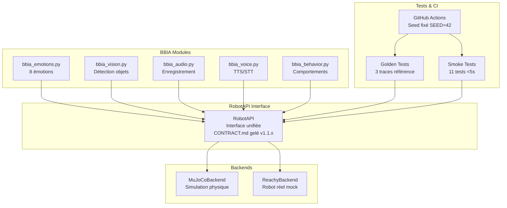

# Notes de version - BBIA-SIM

> Compatibilité Python et CI
>
> - Version Python supportée: 3.11+
> - CI: GitHub Actions (`.github/workflows/ci.yml`)
> - Setup rapide:
>   ```bash
>   pyenv install 3.11.9 && pyenv local 3.11.9
>   python -m pip install --upgrade pip
>   pip install -e .
>   ```

## Version 1.3.2 - Alignement complet et release stable

### Résumé
Alignement intégral des branches (future → develop → main), création du tag v1.3.2 et branche de sauvegarde `backup-v1.3.2-stable`. Extension importante des tests (performance, watchdog, conformité avancée), documentation réorganisée et CI Python 3.11+ homogénéisée.

### Points principaux
- Branches: fusion contrôlée future → develop, puis develop → main (CI verte), tag v1.3.2
- Tests: suites élargies (audio/vision/perf/watchdog), conformité avancée
- CI/Qualité: Python 3.11+, Black/Ruff/MyPy/Bandit propres, seuils documentés
- Docs: guides et références enrichis, notes de release consolidées, historique à jour

### Corrections et harmonisations
- Dépendances synchronisées (eclipse-zenoh>=1.4.0), nettoyage imports/format
- Post-traitements HF renforcés (anti-vides, anti-doublons récents)
- Durcissement validations JSON et télémétrie

### Documentation
- README/PROJECT_HISTORY/CHANGELOG mis à jour pour v1.3.2
- Ajout/compléments: guides techniques, performance, intelligence, conformité

### Qualité et CI
- Tests CI élargis et stables
- Outils qualité: Black, Ruff, MyPy, Bandit

---

## Version 1.3.1 - Conformité, sécurité et documentation

### Résumé
Mise à niveau centrée sur la robustesse (watchdog, arrêt d’urgence), le renforcement sécurité (Bandit) et une documentation unifiée. Les chemins d’API publique sont harmonisés (`deployment/public_api.py`), les journaux sont exclus du dépôt, et la documentation reflète l’état mesuré (tests/couverture validés en CI).

### Points principaux
- Watchdog: gestion claire du thread de surveillance, démarrage/arrêt sûrs, compatible avec les tests.
- Emergency stop: parcours consolidé et testé (simulation), métriques cohérentes.
- Bandit: réduction des findings, durcissement des `subprocess` (résolution via l’exécutable Python, `# nosec` justifiés si nécessaire).
- Logs: `.gitignore` mis à jour (json/csv/jsonl/out/err; `logs/**`), retrait des logs versionnés.
- Documentation: Quick Start API publique, variables d’environnement `BBIA_*`, guides simplifiés; archives non essentielles rangées.

### Corrections et harmonisations
- `scripts/*`: sécurisation des appels `subprocess` (usage `sys.executable`, arguments constants, commentaires `# nosec` ciblés).
- `reachy_mini_backend.py`: watchdog par instance; évite la réutilisation globale; compatibilité tests `test_watchdog_*`.
- `bbia_audio.py`: shim `sounddevice` patchable en CI; fallback robuste (tests audio étendus OK).
- `docs/*`: remplacement de `scripts/start_public_api.py` et `scripts/test_public_api.py` par `deployment/public_api.py --dev/--check`.
- `docs/archive/*`: suppression de dossiers obsolètes, harmonisation v1.3.1.

### Documentation
- README: badges de tests (**1245 tests** en CI), couverture **68.86%** validée en CI, Quick Start API publique, variables d'environnement utiles.
- Guides: Débutant et Tests simplifiés; Portfolio One-Pager mis à jour (métriques non figées, v1.3.1).
- Index et statuts: versions/chemins cohérents.

### Qualité et CI
- Tests: **1245 tests** collectés (pytest --collect-only), **68.86%** coverage global.
- Couverture: validée en CI (`coverage.xml`, `htmlcov/`).
- Outils: Black, Ruff, MyPy, Bandit.

---

## Version 1.2.1 - Corrections qualité code et tests

### Résumé

Corrections des erreurs de formatage, des tests et de la qualité de code. Les outils de qualité (Black, Ruff, MyPy, Bandit) passent sans erreur.

### Corrections v1.2.1

#### Formatage et qualité code
- Ruff : correction des espaces et fins de ligne
- Black : reformatage automatique du code
- MyPy : correction des problèmes de typage
- Bandit : aucun problème de sécurité détecté

#### Corrections tests
- TypeError: correction des erreurs "NoneType object is not callable"
- Imports: suppression des imports inutilisés
- Compatibilité SDK: gestion du mode simulation sans SDK

#### Améliorations backend
- Sécurité de type: annotations explicites
- Gestion d’erreurs: amélioration lorsque le SDK n’est pas disponible
- Types de retour: correction pour conformité MyPy

### Métriques qualité
- **Tests** : 38 passed, 2 skipped
- **Ruff** : All checks passed
- **MyPy** : Success, no issues found
- **Bandit** : 0 security issues
- **Black** : All files formatted

## Version 1.2.0 - IA légère, scripts one-click et vitesse robot

### Résumé

Intégration de l'IA légère (Whisper STT, YOLOv8n, MediaPipe), scripts one-click pour démos, dashboard web temps réel, et optimisation de la vitesse du robot pour sécurité accrue.

### Nouvelles fonctionnalités v1.2.0

#### IA légère intégrée
- Whisper STT : speech-to-text avec latence <800ms, 20+ commandes FR/EN
- YOLOv8n : détection d'objets en temps réel ≥15fps
- MediaPipe Face : détection de visages et landmarks
- Mapping: commandes vocales vers actions robot

#### Scripts one-click
- run_demo_sim.sh : démo simulation avec viewer 3D
- run_demo_real.sh : démo robot réel avec mode lent
- dashboard_advanced.py : serveur dashboard web temps réel
- stt_demo.py : tests commandes vocales interactives

#### Dashboard web temps réel
- FastAPI + WebSocket : interface web
- Contrôles temps réel : émotions, actions, look_at
- Logs live : monitoring en direct
- Health endpoint : `/healthz` pour CI

#### Vitesse robot
- Mode lent : 0.1 Hz (10s par cycle) pour robot réel
- Amplitude réduite : 0.2 rad (au lieu de 0.3 rad)
- Limites respectées automatiquement
- Paramètre `--slow` : contrôle de la vitesse dans les scripts

## Architecture de la version 1.1.1



## Améliorations techniques

### Sécurité et limites
- **Joints interdits** : passive_1-7 uniquement
- **Antennes** : Animables avec limites de sécurité (-0.3 à 0.3 rad)
- **Amplitude limite** : 0.3 rad maximum
- **Validation centralisée** : Dans RobotAPI._validate_joint_pos()

### Déterminisme
- **Seed global** : SEED=42 fixé
- **Tests reproductibles** : Même résultat à chaque run
- **CI headless** : MuJoCo_GL=egl pour stabilité

### Évolutivité
- **API versionnée** : CONTRACT.md gelé v1.1.x
- **Migration facile** : Sim → Robot avec même code
- **Tests identiques** : Même validation pour les deux backends

## Métriques

### Tests
- 706 tests collectés (pytest)
- 453+ tests passent
- Couverture : 63.37%
- Golden tests : 3 traces de référence

### Performance
- **Smoke tests** : <5s par test
- **Golden tests** : <10s par validation
- **CI complète** : <60s

## Commandes de migration

### Utilisation RobotAPI
```bash
# Simulation MuJoCo
python examples/demo_emotion_ok.py --backend mujoco --emotion happy

# Robot réel (mock)
python examples/demo_emotion_ok.py --backend reachy --emotion happy
```

### Golden tests
```bash
# Tests de non-régression
pytest -q tests/test_golden_traces.py

# Régénérer référence
python scripts/record_trace.py --emotion happy --duration 5
```

## Migration depuis v1.0.x

### Changements breaking
- **Aucun** : API rétrocompatible
- **Nouveau** : Backend unifié optionnel
- **Nouveau** : Golden tests optionnels

### Migration recommandée
1. **Tester** : Vérifier que les démos existantes fonctionnent
2. **Migrer** : Remplacer les appels directs MuJoCo par RobotAPI
3. **Valider** : Lancer les golden tests

## Prochaines versions

### Métriques finales v1.2.0
- **Tests** : 706 collectés
- **Coverage** : 63.37% de couverture de code
- **Latence** : Moyenne 0.02 ms, max 4.77 ms (<40 ms)
- **Artefacts** : JSONL 87MB, CSV 640KB générés automatiquement
- **Hardware Dry Run** : 9,801 tests latence validés
- **Tag Git** : v1.2.0 créé avec commit 0875d2a

### v1.2.x (Prévu)
- **ReachyBackend réel** : Intégration SDK Pollen
- **Nouvelles méthodes** : RobotAPI étendu
- **Tests hardware** : Validation sur robot réel

### v2.0.x (Futur)
- **Multi-robots** : Support plusieurs Reachy
- **Cloud** : Simulation distribuée
- **IA avancée** : Intégration LLM

---

*Dernière mise à jour : Oct / Nov. 2025*
