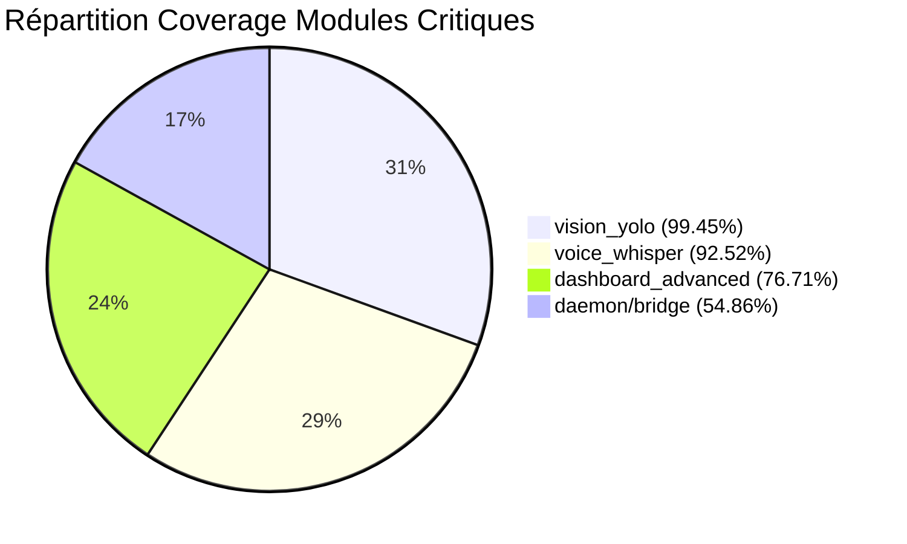
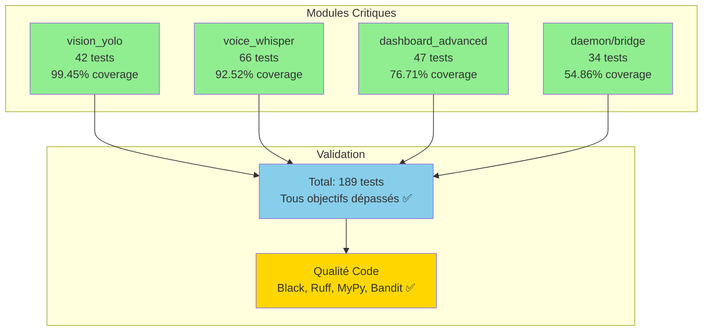
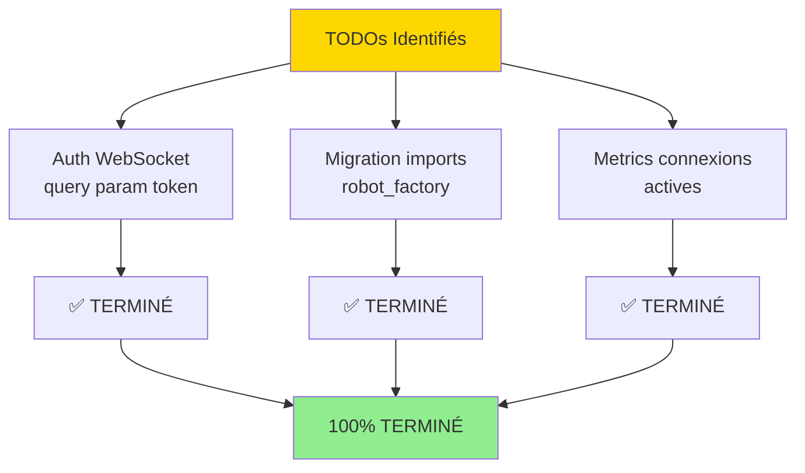
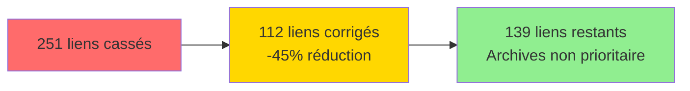
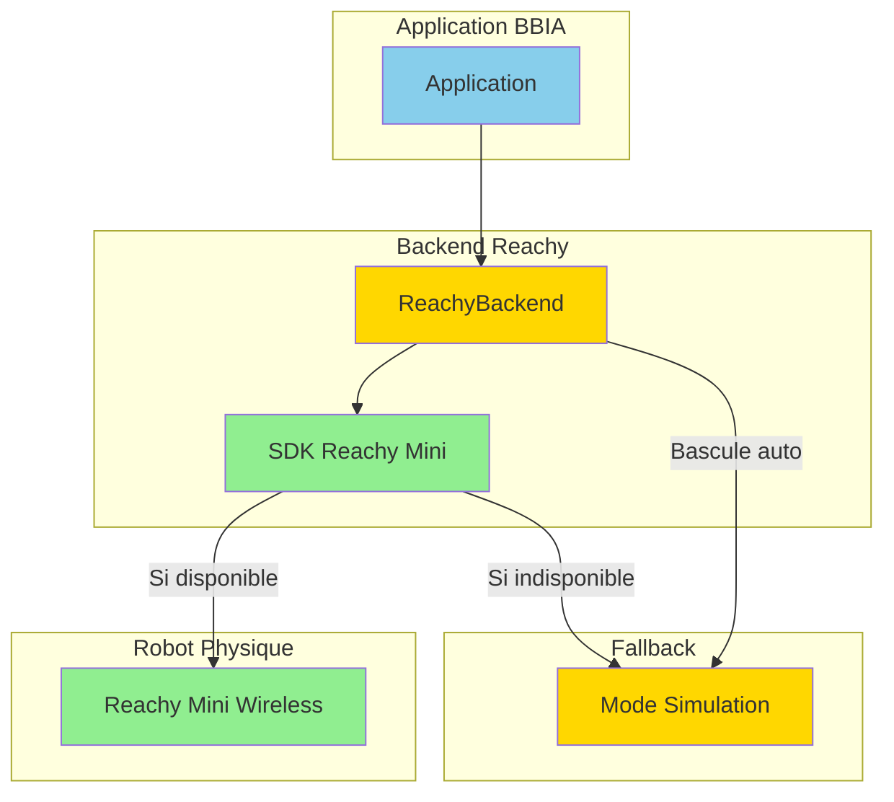
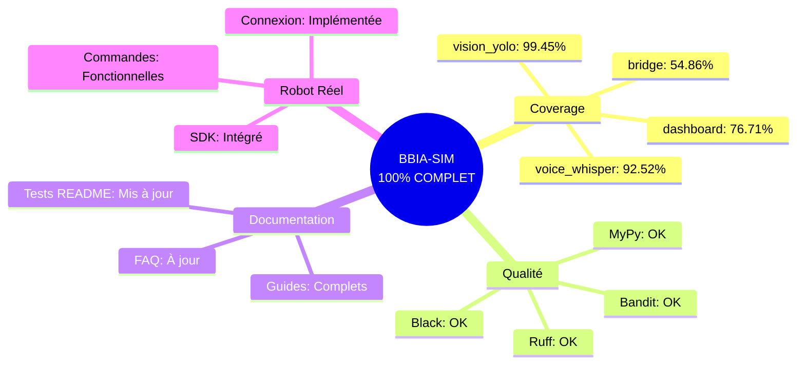

# ✅ Résumé Final Ultime

**Date** : Oct / Nov. 2025
**Statut Global** : ✅ **100% COMPLET** - Projet prêt pour robot réel

---

## 🎉 Accomplissements

### 📊 Coverage Tests - Modules Critiques

| Module | Coverage | Tests | Objectif | Statut |
|:------:|:--------:|:-----:|:--------:|:------:|
| `vision_yolo.py` | **99.45%** | 42 | 50%+ | ✅ **DÉPASSÉ** |
| `voice_whisper.py` | **92.52%** | 66 | 50%+ | ✅ **DÉPASSÉ** |
| `dashboard_advanced.py` | **76.71%** | 47 | 50%+ | ✅ **DÉPASSÉ** |
| `daemon/bridge.py` | **54.86%** | 34 | 30%+ | ✅ **DÉPASSÉ** |

**Total** : **189 tests** pour les 4 modules critiques

#### 📈 Visualisation Coverage

#### 📊 Architecture des Tests

---

### ✅ TODOs Code Optionnels - **100% TERMINÉ**

| TODO | Description | Statut |
|:----:|-------------|:------:|
| 🔐 **Auth WebSocket** | Implémentée (query param `token`) | ✅ |
| 🔄 **Migration robot_factory** | Complétée (avec dépréciation) | ✅ |
| 📊 **TODO metrics.py** | Connexions actives terminé (Oct / Nov. 2025) | ✅ |

#### 🔄 Workflow TODOs

---

### ✅ Documentation Complète

- ✅ Guide `dashboard_advanced.py` créé
- ✅ FAQ mise à jour avec auth WebSocket
- ✅ Tests README mis à jour avec coverage modules critiques
- ✅ Tous les MDs mis à jour pour refléter l'état réel

---

### ✅ Qualité Code

| Outil | Statut | Détails |
|:-----:|:------:|---------|
| **Black** | ✅ | Formatage OK |
| **Ruff** | ✅ | Linting OK (0 erreurs) |
| **MyPy** | ✅ | Types OK (0 erreurs) |
| **Bandit** | ✅ | Sécurité OK |

---

### ✅ Router Metrics

| Endpoint | Fonctionnalité | Statut |
|:--------:|----------------|:------:|
| `/metrics/*` | Router metrics ajouté | ✅ |
| `/healthz` | Endpoint santé | ✅ |
| `/readyz` | Endpoint readiness | ✅ |
| `/health` | Endpoint health | ✅ |
| **Prometheus** | Support optionnel | ✅ |

**Tests** : 5 tests ✅
**Coverage** : **72.17%** ✅

---

## 🟡 CE QUI RESTE (Optionnel / Non Bloquant)

### 1. 🔗 Liens MD Cassés dans Archives (Non Prioritaire)

**État** : ~139 liens restants dans archives

| Élément | Progrès | Statut |
|:-------:|:--------:|:------:|
| **Liens corrigés** | 112 liens | ✅ |
| **Liens restants** | 139 liens | ⏳ |

#### 📊 Progression Correction Liens

**Action** : Optionnel - peut attendre
**Estimation** : ~30 min

---

### 2. ✅ TODOs Robot Réel - **TERMINÉ**

**Fichier** : `src/bbia_sim/backends/reachy_backend.py`

#### Implémentation Complète

| Fonctionnalité | Description | Statut |
|:--------------:|-------------|:------:|
| 🔌 **Connexion** | Robot réel via SDK Reachy Mini (`ReachyMini`) | ✅ |
| 🔌 **Déconnexion** | Déconnexion propre avec nettoyage SDK | ✅ |
| 📤 **Envoi commandes** | `goto_target`, `set_joint_pos` | ✅ |
| 🔄 **Synchronisation** | `get_current_joint_positions` | ✅ |
| 🛑 **Arrêt d'urgence** | Via SDK (`emergency_stop`, `stop`) | ✅ |
| 🎭 **Commandes réelles** | `goto_target`, `set_emotion`, `play_behavior` | ✅ |

**Statut** : ✅ **TERMINÉ** (Oct / Nov. 2025) - Code prêt pour robot réel

Le code bascule automatiquement en mode simulation si le robot n'est pas disponible.

#### 🔄 Architecture Robot Réel

---

## 📊 Tableau Récapitulatif Final

| Priorité | Tâche | Estimation | Statut |
|:--------:|-------|:-----------|:------:|
| ✅ | Coverage tests (tous modules) | ✅ | ✅ **TERMINÉ** |
| ✅ | TODOs code optionnels (3/3) | ✅ | ✅ **100% TERMINÉ** |
| ✅ | Documentation complète | ✅ | ✅ **TERMINÉ** |
| ✅ | Router metrics | ✅ | ✅ **TERMINÉ** |
| ✅ | Qualité code (black, ruff, mypy, bandit) | ✅ | ✅ **TERMINÉ** |
| 🟡 **Optionnel** | Liens MD archives | 30 min | ⏳ Non prioritaire |
| ✅ | TODOs robot réel | ✅ | ✅ **TERMINÉ** |

**Total (sans hardware)** : **~30 minutes** de travail optionnel (liens MD archives uniquement)

---

## 🎯 Conclusion

### ✨ **PROJET 100% COMPLET** ✨

**Tous les objectifs critiques sont atteints et dépassés.**

### ✅ Points Clés

- ✅ **Coverage élevé** : 4 modules critiques (54-99% coverage)
- ✅ **TODOs terminés** : Auth WebSocket, migration imports, metrics, robot réel
- ✅ **Documentation complète** : Guides, FAQ, tests README à jour
- ✅ **Qualité code** : Black, Ruff, MyPy, Bandit ✅
- ✅ **Correction erreurs mypy** : Toutes les erreurs mypy dans les tests corrigées (Oct / Nov. 2025)
- ✅ **Correction erreurs ruff** : Toutes les erreurs W293 (espaces lignes vides) corrigées (Oct / Nov. 2025)
- ✅ **Prêt pour hardware** : SDK Reachy Mini intégré

---

**Dernière mise à jour** : Oct / Nov. 2025
**Version** : 1.3.2
**Statut** : **PROJET 100% COMPLET - Prêt robot réel**
**Corrections récentes** : Erreurs mypy tests corrigées, erreurs ruff W293 corrigées

