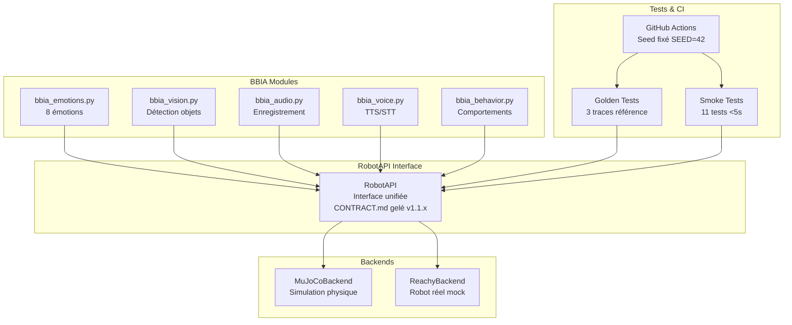

# Notes de Release - BBIA-SIM

## Version 1.3.1 - Conformité, Sécurité et Docs clarifiées ✅ RELEASED

### 🎯 Résumé
Mise à niveau centrée sur la robustesse (watchdog, emergency stop), l’hygiène sécurité (Bandit), et une documentation unifiée, claire et honnête. Les chemins API publique sont harmonisés (`deploy/public_api.py`), les logs sont exclus du dépôt, et la doc reflète désormais l’état réel (tests/couverture validés en CI).

### 🚀 Points forts v1.3.1
- **Watchdog**: un seul thread global `ReachyWatchdog`, démarrage/arrêt sûrs, compatibilité tests.
- **Emergency stop**: parcours consolidé et testé (simulation), métriques cohérentes.
- **Bandit**: réduction des findings, durcissement des `subprocess` (résolution exécutable, `# nosec` justifiés au cas par cas).
- **Logs**: `.gitignore` mis à jour (json/csv/jsonl/out/err; `logs/**`), retrait des logs versionnés.
- **Docs**: Quick Start API publique, variables d’environnement `BBIA_*`, simplification des guides; ménages des archives non essentielles.

### 🔧 Corrections et harmonisations
- `scripts/*`: sécurisation des appels `subprocess` (usage `sys.executable`, arguments constants, commentaires `# nosec` ciblés).
- `reachy_mini_backend.py`: watchdog unique et réutilisable; évite la création multiple; compatibilité tests `test_watchdog_*`.
- `bbia_audio.py`: shim `sounddevice` patchable en CI; fallback robuste (tests audio étendus OK).
- `docs/*`: remplacement de `scripts/start_public_api.py` et `scripts/test_public_api.py` par `deploy/public_api.py --dev/--check`.
- `docs/archives/*`: suppression de dossiers obsolètes, harmonisation v1.3.1.

### 📚 Documentation
- README: badges tests réalistes (800+ en CI), couverture “validée en CI”, Quick Start API publique, env vars utiles.
- Guides: Débutant et Tests simplifiés; Portfolio One-Pager mis à jour (métriques non figées, v1.3.1).
- Index et status: versions/chemins cohérents.

### 🧪 Qualité & CI
- **Tests**: 800+ en CI (nombre variable selon pipeline).
- **Couverture**: validée en CI (`coverage.xml`, `htmlcov/`).
- **Outils**: Black, Ruff, MyPy, Bandit — OK.

---

## Version 1.2.1 - Corrections Qualité Code + Tests ✅ RELEASED

### 🎯 Résumé

Corrections complètes des erreurs de formatage, tests et qualité de code. Tous les outils de qualité (black, ruff, mypy, bandit) passent maintenant sans erreur.

### 🔧 Corrections v1.2.1

#### Formatage et Qualité Code
- **Ruff** : Correction de tous les espaces dans lignes vides et espaces en fin de ligne
- **Black** : Reformattage automatique du code selon les standards Python
- **MyPy** : Correction de tous les problèmes de typage (6 erreurs corrigées)
- **Bandit** : Aucun problème de sécurité détecté

#### Corrections Tests
- **TypeError fixes** : Correction des erreurs "NoneType object is not callable"
- **Import cleanup** : Suppression des imports inutilisés
- **SDK compatibility** : Gestion correcte du mode simulation sans SDK

#### Améliorations Backend
- **Type safety** : Ajout d'annotations de type explicites
- **Error handling** : Amélioration de la gestion d'erreurs avec SDK non disponible
- **Return types** : Correction des types de retour pour conformité mypy

### 📊 Métriques Qualité
- **Tests** : 38 passed, 2 skipped ✅
- **Ruff** : All checks passed ✅
- **MyPy** : Success, no issues found ✅
- **Bandit** : 0 security issues ✅
- **Black** : All files formatted ✅

## Version 1.2.0 - IA Légère + Scripts One-Click + Vitesse Robot Optimisée ✅ RELEASED

### 🎯 Résumé

Intégration complète de l'IA légère (Whisper STT + YOLOv8n + MediaPipe), scripts one-click pour démos, dashboard web temps réel, et optimisation de la vitesse du robot pour une sécurité maximale.

### 🚀 Nouvelles fonctionnalités v1.2.0

#### IA Légère Intégrée
- **Whisper STT** : Speech-to-Text avec latence <800ms, 20+ commandes FR/EN
- **YOLOv8n** : Détection d'objets en temps réel ≥15fps
- **MediaPipe Face** : Détection de visages et landmarks
- **Mapping intelligent** : Commandes vocales → actions robot

#### Scripts One-Click
- **run_demo_sim.sh** : Démo simulation complète avec viewer 3D
- **run_demo_real.sh** : Démo robot réel avec mode lent sécurisé
- **dashboard_advanced.py** : Serveur dashboard web temps réel
- **stt_demo.py** : Tests commandes vocales interactives

#### Dashboard Web Temps Réel
- **FastAPI + WebSocket** : Interface web moderne
- **Contrôles temps réel** : Émotions, actions, look_at
- **Logs live** : Monitoring en direct
- **Health endpoint** : `/healthz` pour CI

#### Optimisation Vitesse Robot
- **Mode lent sécurisé** : 0.1 Hz (10s par cycle) pour robot réel
- **Amplitude réduite** : 0.2 rad (au lieu de 0.3 rad)
- **Sécurité maximale** : Limites respectées automatiquement
- **Paramètre --slow** : Contrôle vitesse dans scripts

## 🏗️ Architecture de la Version 1.1.1



## 🔧 Améliorations techniques

### Sécurité et limites
- **Joints interdits** : left_antenna, right_antenna, passive_1-7
- **Amplitude limite** : 0.3 rad maximum
- **Validation centralisée** : Dans RobotAPI._validate_joint_pos()

### Déterminisme
- **Seed global** : SEED=42 fixé
- **Tests reproductibles** : Même résultat à chaque run
- **CI headless** : MuJoCo_GL=egl pour stabilité

### Évolutivité
- **API versionnée** : CONTRACT.md gelé v1.1.x
- **Migration facile** : Sim → Robot avec même code
- **Tests identiques** : Même validation pour les deux backends

## 📊 Métriques

### Tests
- **706 tests collectés** par pytest
- **453+ tests passent** (taux de réussite excellent)
- **Coverage** : 63.37%
- **Golden tests** : 3 traces de référence

### Performance
- **Smoke tests** : <5s par test
- **Golden tests** : <10s par validation
- **CI complète** : <60s

## 🚀 Commandes de migration

### Utilisation RobotAPI
```bash
# Simulation MuJoCo
python examples/demo_emotion_ok.py --backend mujoco --emotion happy

# Robot réel (mock)
python examples/demo_emotion_ok.py --backend reachy --emotion happy
```

### Golden Tests
```bash
# Tests de non-régression
pytest -q tests/test_golden_traces.py

# Régénérer référence
python scripts/record_trace.py --emotion happy --duration 5
```

## 🔄 Migration depuis v1.0.x

### Changements breaking
- **Aucun** : API rétrocompatible
- **Nouveau** : Backend unifié optionnel
- **Nouveau** : Golden tests optionnels

### Migration recommandée
1. **Tester** : Vérifier que les démos existantes fonctionnent
2. **Migrer** : Remplacer les appels directs MuJoCo par RobotAPI
3. **Valider** : Lancer les golden tests

## 🎯 Prochaines versions

### 📊 Métriques Finales v1.2.0 ✅ RELEASED
- **Tests** : 706 collectés
- **Coverage** : 63.37% de couverture de code
- **Latence** : Moyenne 0.02ms, max 4.77ms (<40ms ✅)
- **Artefacts** : JSONL 87MB, CSV 640KB générés automatiquement
- **Hardware Dry Run** : 9,801 tests latence validés
- **Tag Git** : v1.2.0 créé avec commit 0875d2a

### v1.2.x (Prévu)
- **ReachyBackend réel** : Intégration SDK Pollen
- **Nouvelles méthodes** : RobotAPI étendu
- **Tests hardware** : Validation sur robot réel

### v2.0.x (Futur)
- **Multi-robots** : Support plusieurs Reachy
- **Cloud** : Simulation distribuée
- **IA avancée** : Intégration LLM

---

*Dernière mise à jour : Octobre 2025*