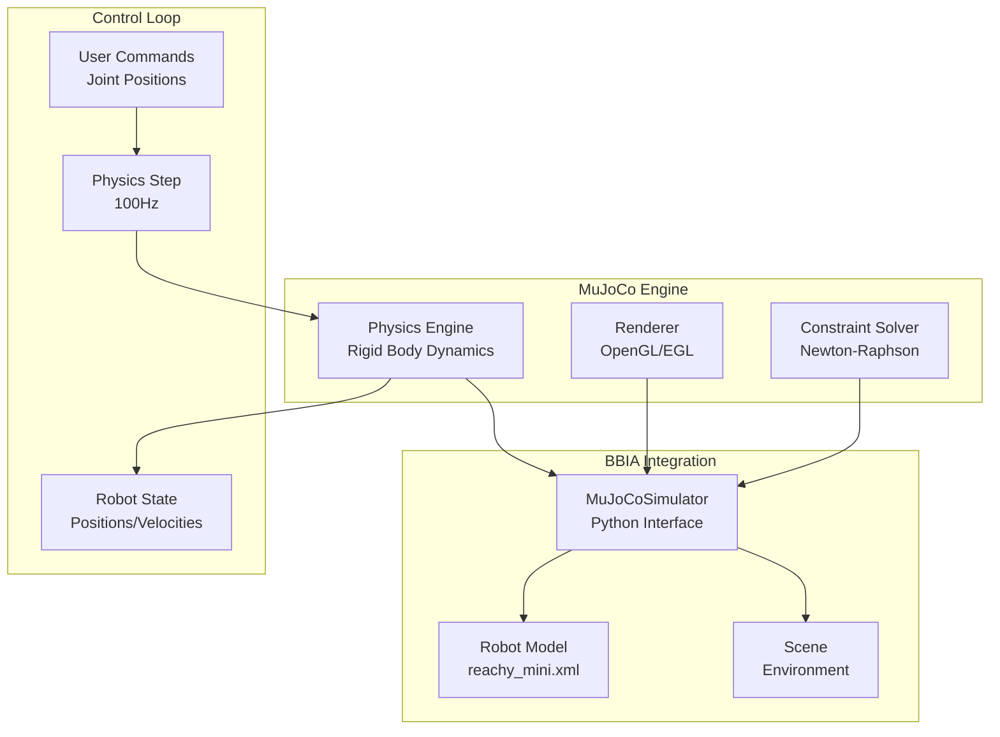
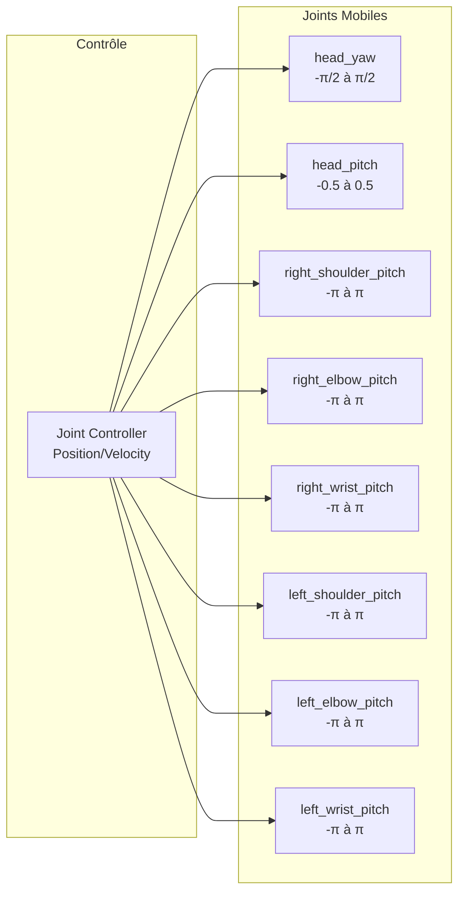
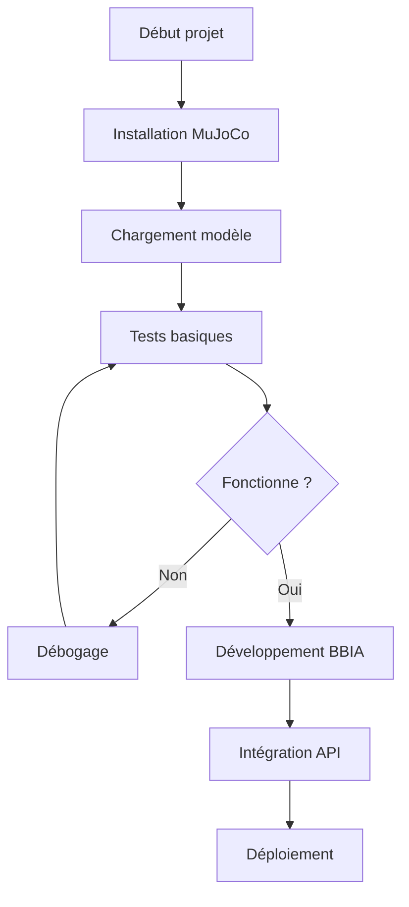

# 🎮 Simulation MuJoCo - Guide d'utilisation

**Dernière mise à jour : 15 Décembre 2025

> **Compatibilité Python** : Python 3.11+ requis. Voir [`docs/getting-started/INSTALLATION.md`](../getting-started/INSTALLATION.md) pour les détails d'installation.

## Vue d'ensemble

BBIA-SIM intègre une simulation 3D complète basée sur MuJoCo pour le robot Reachy Mini. Cette simulation permet de tester les comportements et mouvements du robot dans un environnement virtuel avant de les appliquer au robot physique.

## 🚀 Démarrage rapide

### Installation des prérequis

```bash
# macOS
brew install mujoco

# Linux (Ubuntu/Debian)
sudo apt-get install libglfw3-dev libgl1-mesa-dev

# Installation des dépendances Python
pip install -e .[dev]

```

### Lancement de la simulation

```bash
# Simulation par défaut
python -m bbia_sim --sim

# Simulation avec scène simple
python -m bbia_sim --sim --scene simple

# Mode headless (sans interface graphique)
python -m bbia_sim --sim --headless

# Modèle personnalisé
python -m bbia_sim --sim --model /path/to/custom_model.xml

```

## 📁 Structure des fichiers

```text
src/bbia_sim/sim/
├── __init__.py              # Module de simulation
├── simulator.py             # Classe MuJoCoSimulator
├── models/
│   └── reachy_mini.xml     # Modèle principal du robot
├── scenes/
│   └── simple_scene.xml    # Scène avec objets de test
└── assets/
    ├── meshes/             # Modèles 3D (futur)
    └── textures/           # Textures (futur)

```

## 🤖 Architecture MuJoCo



## 🎯 Joints du Robot Reachy Mini



## 🎯 Utilisation programmatique

### Exemple basique

```python
from bbia_sim.sim.simulator import MuJoCoSimulator

# Initialisation
simulator = MuJoCoSimulator("src/bbia_sim/sim/models/reachy_mini.xml")

# Lancement de la simulation
simulator.launch_simulation()

```

### Contrôle du robot

```python
# Obtenir l'état du robot
state = simulator.get_robot_state()
logging.info(f"Positions articulations : {state['joint_positions']}")

# Définir des positions
import numpy as np
positions = np.array([0.1, 0.2, 0.3, -0.1, -0.2, -0.3, 0.0, 0.0])
simulator.set_joint_positions(positions)

```

### Mode headless

```python
# Simulation sans interface graphique
simulator.launch_simulation(headless=True)

```

## 🎨 Scènes personnalisées

### Création d'une scène simple

```python
from bbia_sim.sim.simulator import create_simple_scene

# Crée une scène avec des objets de test
scene_path = create_simple_scene()
simulator.load_scene(scene_path)

```

### Format MJCF

Les scènes utilisent le format MJCF (MuJoCo XML). Exemple minimal :

```xml
<mujoco model="ma_scene">
  <compiler angle="radian"/>

  <worldbody>
    <light pos="0 0 3" dir="0 0 -1"/>
    <geom name="floor" type="plane" size="0 0 0.1"/>

    <body name="objet" pos="0 0 0.1">
      <geom name="box" type="box" size="0.1 0.1 0.1" rgba="1 0 0 1"/>
    </body>
  </worldbody>
</mujoco>

```

## 🔧 Dépannage

### Problèmes courants

1. **Erreur "MuJoCo not found"**

   ```bash
   # Vérifier l'installation
   python -c "import mujoco; import logging; logging.info(mujoco.__version__)"

   ```

2. **Fenêtre graphique ne s'ouvre pas**

   ```bash
   # Tester en mode headless
   python -m bbia_sim --sim --headless

   ```

3. **Modèle MJCF invalide**

   ```bash
   # Vérifier la syntaxe XML
   xmllint --noout src/bbia_sim/sim/models/reachy_mini.xml

   ```

### Logs et débogage

```bash
# Mode verbose
python -m bbia_sim --sim --verbose

# Logs détaillés
export MUJOCO_LOG_LEVEL=DEBUG
python -m bbia_sim --sim

```

## 🚀 Intégration avec l'API

La simulation peut être intégrée avec l'API REST :

```python
# Dans le daemon API
from bbia_sim.sim.simulator import MuJoCoSimulator

class RobotController:
    def __init__(self):
        self.simulator = MuJoCoSimulator("models/reachy_mini.xml")

    def goto_pose(self, pose):
        # Convertir pose en positions articulations
        positions = self.calculate_joint_positions(pose)
        self.simulator.set_joint_positions(positions)
        return {"status": "moving", "pose": pose}

```

## 📈 Performance et Optimisation

```mermaid
graph TB
    subgraph "Modes de Simulation"
        GRAPHIC[Mode Graphique<br/>60-120 FPS<br/>Interface utilisateur]
        HEADLESS[Mode Headless<br/>1000+ FPS<br/>Tests automatisés]
    end

    subgraph "Optimisations"
        TIMESTEP[Timestep<br/>0.01s (100Hz)]
        SOLVER[Solver<br/>Newton-Raphson]
        CACHE[Cache<br/>Modèles préchargés]
    end

    subgraph "Ressources"
        CPU[CPU<br/>~50% utilisation]
        GPU[GPU<br/>Rendu graphique]
        RAM[Mémoire<br/>~50MB modèle]
    end

    GRAPHIC --> TIMESTEP
    HEADLESS --> TIMESTEP
    TIMESTEP --> SOLVER
    SOLVER --> CACHE

    CACHE --> CPU
    CACHE --> GPU
    CACHE --> RAM

```

## 🔧 Workflow de Développement



## 🔮 Roadmap

- [ ] Intégration avec l'API REST
- [ ] Scènes complexes avec objets interactifs
- [ ] Physique avancée (collisions, contacts)
- [ ] Enregistrement/replay de mouvements
- [ ] Interface graphique améliorée
- [ ] Support multi-robots

---

## 🎯 Navigation

**Retour à** : [README Documentation](../README.md)  
**Voir aussi** : [Index Simulations](INDEX_GUIDES_PROCREATE.md) • [Index Thématique](../reference/INDEX_THEMATIQUE.md)
