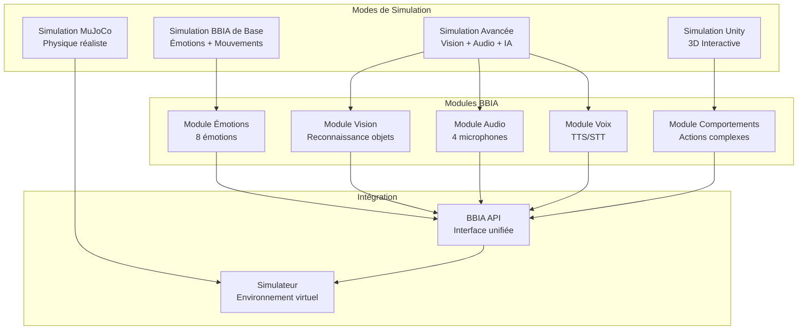
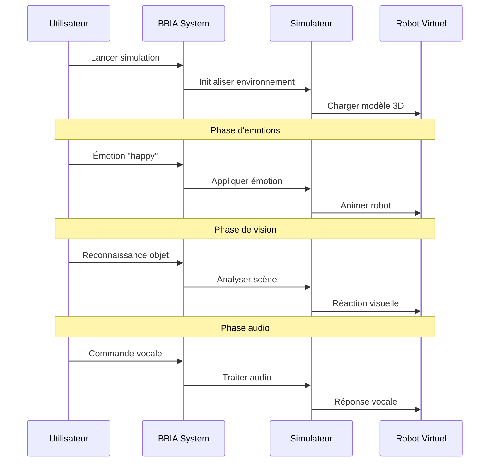
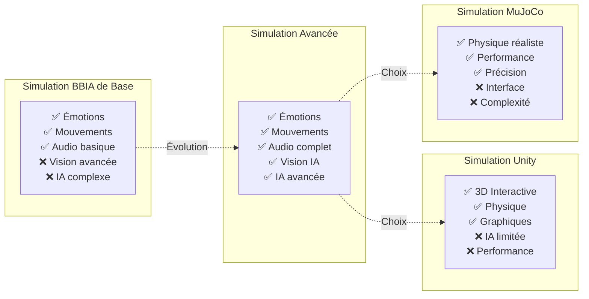

# Simulation BBIA complète - tous les modes

> Compatibilité Python et CI
>
> - Python requis: 3.11+
> - CI: `.github/workflows/ci.yml`
> - Setup rapide:
>   ```bash
>   pyenv install 3.11.9 && pyenv local 3.11.9
>   python -m pip install --upgrade pip
>   pip install -e .
>   ```

## État actuel - phase 1 terminée

### Dépôts installés avec succès
- `reachy-docs` : documentation officielle complète
- `reachy-unity-package` : simulation Unity
- `pollen-vision` : vision par ordinateur (testé)
- `reachy2-sdk-audio-server-rs` : serveur audio
- `reachy2-behaviors-dev` : comportements
- `reachy-dashboard` : interface web
- `reachy-face-tracking` : suivi de visage
- `reachy2-tutorials` : tutoriels et exemples

---

## Architecture simulation BBIA



## Workflow de simulation



## Comparaison des modes de simulation



## Modes de simulation disponibles
```
**Ce que vous verrez :**
- 🎮 Modèle 3D complet de Reachy
- 🎭 Expressions faciales animées
- 🤖 Mouvements fluides en temps réel
- 🎪 Environnement 3D interactif
- 🎯 Contrôle via interface Unity

### 3. Interface web dashboard
```bash
cd reachy_repos/reachy-dashboard
# Suivre les instructions du README
```
**Ce que vous verrez :**
- 📊 Interface web de contrôle
- 📈 Visualisation en temps réel
- 🎛️ Contrôles avancés
- 📱 Interface responsive

### 4. Vision par ordinateur
```bash
python3 -c "
import pollen_vision
print('pollen-vision disponible')
print('Fonctionnalités :')
print('  • Reconnaissance d\'objets')
print('  • Détection de visages')
print('  • Analyse d\'expressions')
print('  • Suivi de mouvements')
"
```
**Ce que vous verrez :**
- 👁️ Reconnaissance d'objets en temps réel
- 🎭 Détection d'expressions faciales
- 🎯 Suivi de visages
- 📊 Analyse de mouvements

### 5. Suivi de visage
```bash
cd reachy_repos/reachy-face-tracking
# Suivre les instructions du README
```
**Ce que vous verrez :**
- 🎯 Suivi automatique des visages
- 👁️ Regard qui suit l'utilisateur
- 🎭 Détection d'expressions
- 🤖 Mouvements de tête automatiques

### 6. Comportements avancés
```bash
cd reachy_repos/reachy2-behaviors-dev
# Explorer les exemples de comportements
```
**Ce que vous verrez :**
- 🎪 Comportements pré-programmés
- 🎭 Réactions automatiques
- 🤖 Actions complexes
- 🎯 Interactions naturelles

---

## Guide de démarrage rapide

### Option 1 : Simulation complète (recommandée)
```bash
# 1. Lancer BBIA de base
python3 test_bbia_reachy.py

# 2. Dans un autre terminal, lancer Unity
./quick_start.sh
# Choisir l'option 6

# 3. Ouvrir le dashboard web
cd reachy_repos/reachy-dashboard
# Suivre les instructions
```

### Option 2 : Menu interactif
```bash
./quick_start.sh
```
**Options disponibles :**
- Option 1 : Tester BBIA (simulation rapide)
- Option 6 : Lancer Unity
- Option 7 : Tester Unity
- Option 10 : Installer dépôts (déjà fait)

### Option 3 : Simulation avancée
```bash
# 1. Tester pollen-vision
python3 -c "import pollen_vision; print('Vision OK')"

# 2. Explorer les tutoriels
cd reachy_repos/reachy2-tutorials
ls -la

# 3. Tester le suivi de visage
cd reachy_repos/reachy-face-tracking
ls -la
```

---

## Détails des simulations

### Simulation BBIA de base
```
🤖============================================================🤖
🌟 BBIA - Brain-Based Interactive Agent
🤖 Robot: Reachy Mini Wireless
📅 Date: Oct / Oct / Nov. 20255
💻 Système: darwin
🤖============================================================🤖

📋 Spécifications Reachy Mini Wireless:
  Height: 28cm (23cm veille)
  Width: 16cm
  Weight: 1.5kg
  Processor: Raspberry Pi 5
  Microphones: 4
  Speaker Power: 5W
  Head Dof: 6
  Camera: Grand angle
  Battery: Intégrée + USB-C
  Connectivity: Wi-Fi intégré

🚀 Démarrage de la simulation BBIA...

🎤 Test des 4 microphones...
  Microphone 1: ✅ Actif
  Microphone 2: ✅ Actif
  Microphone 3: ✅ Actif
  Microphone 4: ✅ Actif

📷 Caméra grand angle: Active
  👁️ Reconnaissance d'objets: En cours...
  🎯 Objets détectés: fenêtre

🎭 Test des émotions:
😐 Émotion changée: neutral
🤖 Mouvement tête (6 DOF): Tête droite, regard neutre
📡 Note: Les antennes sont animables avec limites de sécurité (-0.3 à 0.3 rad) - utilisez yaw_body pour animations principales

😊 Émotion changée: happy
🤖 Mouvement tête (6 DOF): Tête légèrement relevée, regard joyeux
📡 Animation corps: Rotation yaw_body joyeuse (+ antennes animables)

🤔 Émotion changée: curious
🤖 Mouvement tête (6 DOF): Tête inclinée, regard attentif
📡 Animation corps: Rotation yaw_body légère (antennes bloquées)

🤩 Émotion changée: excited
🤖 Mouvement tête (6 DOF): Tête relevée, regard enthousiaste
📡 Animation corps: Rotation yaw_body rapide (antennes bloquées)

😢 Émotion changée: sad
🤖 Mouvement tête (6 DOF): Tête baissée, regard triste
📡 Animation corps: Rotation yaw_body lente (antennes bloquées)

😠 Émotion changée: angry
🤖 Mouvement tête (6 DOF): Tête penchée, regard dur
📡 Animation corps: Rotation yaw_body rigide (antennes bloquées)

🗣️ Test d'interaction vocale:
🗣️ Reconnaissance vocale active...
  🎤 Entendu: 'Que puis-je faire pour vous ?'
🔊 Haut-parleur 5W: 'J'ai compris: Que puis-je faire pour vous ?'

🔋 Test de la batterie:
🔋 Batterie: 100% → 93%

🎉 Simulation terminée !
```

### Simulation Unity 3D
- **Modèle 3D** : Reachy Mini Wireless complet
- **Environnement** : Salle d'interaction
- **Contrôles** : Souris + clavier
- **Fonctionnalités** :
  - 🎭 Expressions faciales animées
  - 🤖 Mouvements de tête fluides
  - 📡 Note: Antennes animables (-0.3 à 0.3 rad) - utiliser yaw_body pour animations principales
  - 🎯 Suivi de visage
  - 🗣️ Reconnaissance vocale
  - 📷 Vision par ordinateur

### Dashboard web
- **Interface** : Web responsive
- **Fonctionnalités** :
  - 📈 Visualisation temps réel
  - 🎛️ Contrôles avancés
  - 📊 Graphiques de performance
  - 🎯 Configuration des paramètres
  - 📱 Compatible mobile

---

## Prochaines étapes - phase 2

### Semaine prochaine : intégration
1. **Intégrer** `pollen-vision` dans BBIA
2. **Intégrer** les comportements avancés
3. **Configurer** le serveur audio
4. **Tester** en simulation Unity

### Dans 2 semaines : comportements
1. **Étudier** `reachy2-behaviors-dev`
2. **Créer** des comportements personnalisés
3. **Intégrer** le suivi de visage
4. **Développer** l'interface dashboard

---

## Commandes rapides

### Lancer toutes les simulations
```bash
# Terminal 1 : BBIA de base
python3 test_bbia_reachy.py

# Terminal 2 : Unity
./quick_start.sh
# Option 6

# Terminal 3 : Dashboard
cd reachy_repos/reachy-dashboard
# Suivre README
```

### Vérifier les installations
```bash
# Vérifier les dépôts
ls -la reachy_repos/

# Vérifier les packages
pip list | grep -i reachy
pip list | grep -i pollen

# Tester pollen-vision
python3 -c "import pollen_vision; print('✅ Vision OK')"
```

### Explorer la documentation
```bash
# Documentation officielle
cd reachy_repos/reachy-docs
ls -la content/

# Tutoriels
cd reachy_repos/reachy2-tutorials
ls -la
```

---

## Résumé

### Phase 1 terminée
- Tous les dépôts GitHub installés
- `pollen-vision` testé et fonctionnel
- Documentation officielle disponible
- Tutoriels et exemples accessibles

### Simulations disponibles
- 🤖 BBIA de base (émotions, mouvements, voix)
- 🎮 Unity 3D (modèle complet interactif)
- 📊 Dashboard web (interface avancée)
- 👁️ Vision par ordinateur (reconnaissance)
- 🎯 Suivi de visage (interaction naturelle)
- 🎪 Comportements avancés (actions complexes)

### 🚀 **Prêt pour la Phase 2**
Vous pouvez maintenant commencer l'intégration des composants dans BBIA !

---

**BBIA** - Brain-Based Interactive Agent
*Guide de simulation complet* 🎮✨

**Phase 1** : ✅ TERMINÉE
**Phase 2** : �� PRÊT À COMMENCER

## 🤖 Séquence de Réveil Réaliste BBIA

La simulation BBIA intègre désormais une séquence de réveil immersive, fidèle au robot Reachy Mini Wireless :
- Lumière progressive, halo bleu, respiration simulée
- Son de démarrage, mouvements de tête et bras, expression, parole
- Synchronisation possible avec Unity pour une expérience complète

**Pour lancer la séquence :**
- Version Python : `python src/bbia_sim/bbia_awake.py`
- Version Unity : via le contrôleur (`python src/bbia_sim/unity_reachy_controller.py awake`)

**Exemple de sortie :**
```
✨ [BBIA] Initialisation du réveil...
💡 Lumière blanche faible...
💡 Lumière qui s'intensifie doucement...
💙 Halo bleu : BBIA s'éveille.
🫧 Respiration simulée : inspiration...
🫧 Respiration simulée : expiration...
🔊 Léger son de démarrage...
🤖 Mouvements de tête lents (simulation)...
🤖 Mouvements de bras légers (simulation)...
😊 Expression : sourire doux.
🗣️ Première pensée : 'Je suis là, Athalia.'
✨ BBIA est complètement réveillé et prêt !
```
