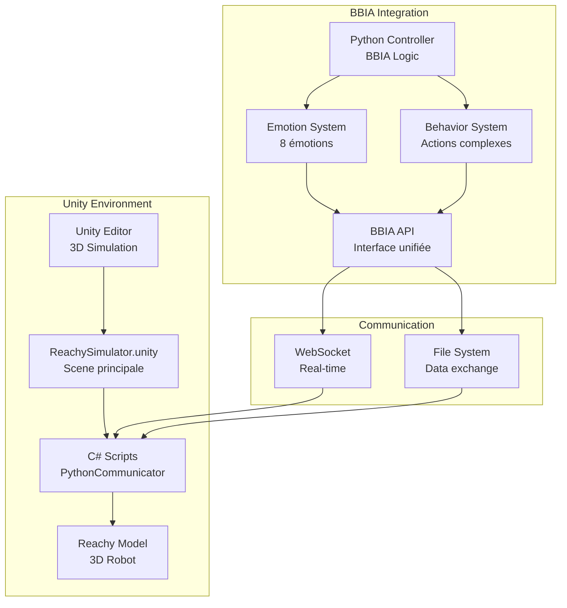
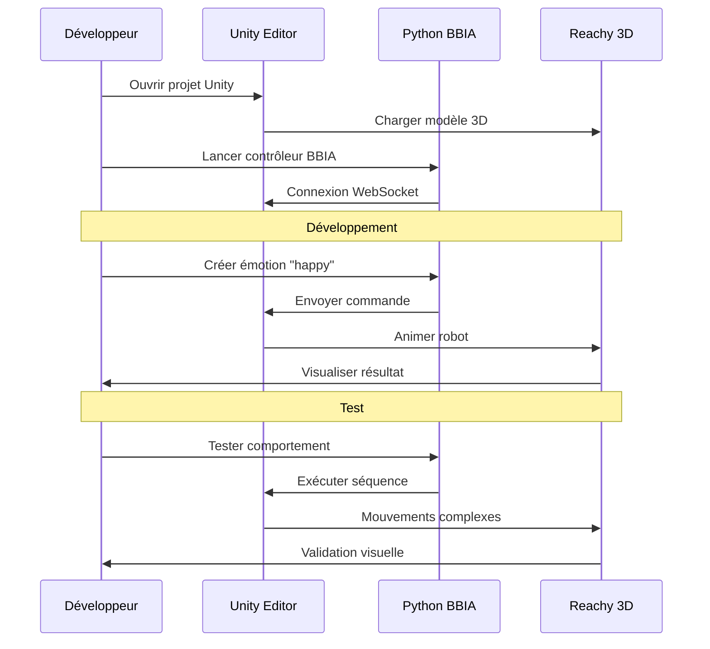

# 🎮 Guide Unity + BBIA - Reachy Mini Wireless

## ✅ Configuration Vérifiée

Votre environnement Unity est maintenant correctement configuré :
- ✅ Unity Hub installé
- ✅ Unity Editor installé
- ✅ Projet Unity présent
- ✅ Scripts Python prêts

## 🚀 Démarrage Rapide Unity

### Option 1: Menu Interactif
```bash
./quick_start.sh
```
Puis choisissez l'option 6 pour lancer le simulateur Unity.

### Option 2: Lancement Direct
```bash
./launch_unity_simulator.sh
```

### Option 3: Test de Configuration
```bash
./test_unity_setup.sh
```

## 🎮 Instructions Unity

### 1. Ouvrir le Projet
1. Lancez Unity Hub
2. Cliquez sur "Open" ou "Ouvrir"
3. Sélectionnez le dossier : `reachy-bbia-unity`
4. Attendez que Unity charge le projet

### 2. Lancer le Simulateur
1. Dans Unity, ouvrez la scène : `Assets/ReachySimulator.unity`
2. Cliquez sur le bouton Play (▶️)
3. Vous devriez voir Reachy dans la fenêtre Unity

### 3. Contrôler BBIA
Une fois le simulateur lancé, vous pouvez :
- Utiliser le contrôleur Python pour programmer BBIA
- Tester les émotions et mouvements
- Développer de nouveaux comportements

## 🏗️ Architecture Unity + BBIA



## 🎮 Workflow Unity + BBIA


- 😐 **Neutral** : Position de repos
- 😊 **Happy** : Mouvements joyeux
- 😢 **Sad** : Mouvements lents
- 😠 **Angry** : Mouvements agressifs
- 🤔 **Curious** : Regards attentifs
- 🤩 **Excited** : Mouvements énergiques

### Contrôles Python
```python
# Exemple de contrôle BBIA
from src.bbia_sim.unity_reachy_controller import UnityReachyController

controller = UnityReachyController()
controller.connect_to_unity()

# Changer l'émotion
controller.set_emotion("happy")

# Mouvements personnalisés
controller.wave_hello()
controller.look_around()
controller.dance_move()
```

## 🔧 Dépannage

### Problème : Unity ne se lance pas
```bash
# Vérifier la configuration
./test_unity_setup.sh

# Relancer Unity Hub
open "/Applications/Unity Hub.app"
```

### Problème : Projet ne charge pas
1. Fermez Unity
2. Supprimez le dossier `reachy-bbia-unity/Library/`
3. Relancez Unity
4. Le projet se recompilera

### Problème : Contrôleur Python ne fonctionne pas
```bash
# Vérifier l'environnement virtuel
source venv/bin/activate

# Tester la connexion
python3 src/bbia_sim/test_unity_connection.py
```

## 📚 Ressources

### Documentation
- [Guide complet Reachy](REACHY_MINI_WIRELESS_COMPLETE_GUIDE.md)
- [Résumé projet](PROJET_COMPLET.md)
- [Démarrage rapide](🎯_DEMARRAGE_RAPIDE.md)

### Liens Officiels
- **Unity** : https://unity.com/
- **Pollen Robotics** : https://www.pollen-robotics.com/
- **Discord** : https://discord.gg/pollen-robotics

## 🎯 Prochaines Étapes

1. **Maintenant** : Tester le simulateur Unity
2. **Prochainement** : Développer de nouveaux comportements BBIA
3. **En attendant** : Étudier le SDK Reachy
4. **Livraison** : Tester sur le vrai robot

## 🌟 Conseils

### Développement
- Sauvegardez régulièrement votre travail
- Testez en simulation avant de déployer
- Documentez vos nouveaux comportements
- Utilisez Git pour le versioning

### Performance
- Fermez les applications inutiles pendant le développement
- Surveillez l'utilisation CPU/GPU
- Optimisez les scripts Python
- Utilisez des timeouts pour éviter les blocages

### Communauté
- Rejoignez le Discord Pollen Robotics
- Partagez vos expériences
- Demandez de l'aide quand nécessaire
- Contribuez aux projets open-source

---

**BBIA** - Brain-Based Interactive Agent  
*Pour Reachy Mini Wireless* 🤖✨

**Unity + BBIA = Puissance Créative !** 🚀 