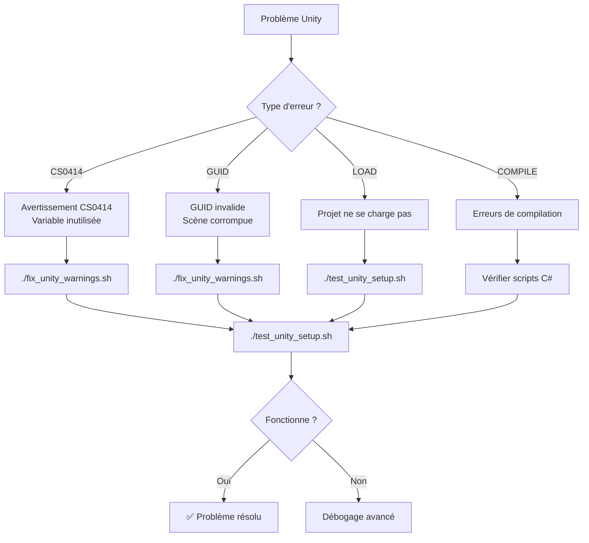
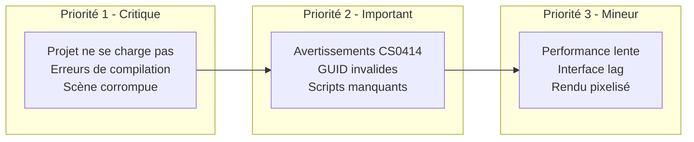

# 🔧 Dépannage Unity - BBIA Reachy Mini Wireless

## 🔧 Diagnostic des Problèmes Unity



## 🚨 Solutions par Priorité


./fix_unity_warnings.sh

# 3. Nettoyer le cache Unity
rm -rf reachy-bbia-unity/Library/
rm -rf reachy-bbia-unity/Temp/
```

### 4. Scripts C# non trouvés

**Symptômes** :
- Erreurs de compilation
- Scripts manquants dans Unity

**Solutions** :
```bash
# 1. Vérifier les scripts
ls -la reachy-bbia-unity/Assets/Scripts/

# 2. Recréer les scripts si nécessaire
./setup_reachy_environment.sh
```

### 5. Communication Python-Unity échoue

**Symptômes** :
- Fichiers de communication non créés
- Pas de réponse du simulateur

**Solutions** :
```bash
# 1. Créer les fichiers de communication
mkdir -p log
touch log/reachy_commands.txt
touch log/reachy_response.txt
chmod 666 log/reachy_commands.txt log/reachy_response.txt

# 2. Tester la communication
python3 src/bbia_sim/test_unity_connection.py
```

## 🛠️ Scripts de Correction

### Script Principal de Correction
```bash
./fix_unity_warnings.sh
```

**Ce script corrige automatiquement** :
- ✅ Variable isWatching supprimée
- ✅ GUID invalide corrigé
- ✅ Fichiers .meta nettoyés
- ✅ Scripts C# vérifiés
- ✅ Configuration Unity créée
- ✅ Structure du projet vérifiée

### Script de Test de Configuration
```bash
./test_unity_setup.sh
```

**Ce script vérifie** :
- ✅ Unity Hub installé
- ✅ Unity Editor installé
- ✅ Projet Unity présent
- ✅ Scripts Python prêts
- ✅ Environnement configuré

## 🎮 Instructions de Récupération

### Étape 1: Diagnostic
```bash
./test_unity_setup.sh
```

### Étape 2: Correction
```bash
./fix_unity_warnings.sh
```

### Étape 3: Test
```bash
# Ouvrir Unity Hub
open "/Applications/Unity Hub.app"

# Ouvrir le projet
# Sélectionner : reachy-bbia-unity

# Tester BBIA
python3 test_bbia_reachy.py
```

## 🔍 Vérifications Manuelles

### 1. Vérifier Unity Hub
```bash
ls -la "/Applications/Unity Hub.app"
```

### 2. Vérifier Unity Editor
```bash
ls -la "/Applications/Unity/Hub/Editor/"
```

### 3. Vérifier le Projet
```bash
ls -la reachy-bbia-unity/
ls -la reachy-bbia-unity/Assets/Scripts/
```

### 4. Vérifier les Scripts Python
```bash
ls -la src/bbia_sim/
python3 test_bbia_reachy.py
```

## 🚨 Problèmes Graves

### Projet Unity Corrompu
```bash
# Sauvegarder les scripts importants
cp -r reachy-bbia-unity/Assets/Scripts/ scripts_backup/

# Supprimer le projet
rm -rf reachy-bbia-unity/

# Recréer le projet
./setup_reachy_environment.sh

# Restaurer les scripts
cp -r scripts_backup/* reachy-bbia-unity/Assets/Scripts/
```

### Unity Hub Ne Fonctionne Plus
```bash
# Réinstaller Unity Hub
# 1. Supprimer Unity Hub
rm -rf "/Applications/Unity Hub.app"

# 2. Télécharger depuis https://unity.com/download
# 3. Réinstaller
```

## 📞 Support

### Ressources Officielles
- **Unity Documentation** : https://docs.unity3d.com/
- **Unity Forums** : https://forum.unity.com/
- **Pollen Robotics Discord** : https://discord.gg/pollen-robotics

### Logs Unity
```bash
# Logs Unity Hub
cat ~/Library/Logs/UnityHub.log

# Logs Unity Editor
cat ~/Library/Logs/Unity/Editor.log
```

## 🎯 Prévention

### Bonnes Pratiques
1. **Sauvegarder régulièrement** votre projet
2. **Tester en simulation** avant de déployer
3. **Utiliser Git** pour le versioning
4. **Documenter** vos modifications
5. **Fermer Unity** proprement

### Maintenance Régulière
```bash
# Nettoyer les fichiers temporaires
find . -name "*.tmp" -delete
find . -name "._*" -delete

# Vérifier la configuration
./test_unity_setup.sh

# Corriger les avertissements
./fix_unity_warnings.sh
```

---

**BBIA** - Brain-Based Interactive Agent  
*Pour Reachy Mini Wireless* 🤖✨

**Unity + BBIA = Puissance Créative !** 🚀 