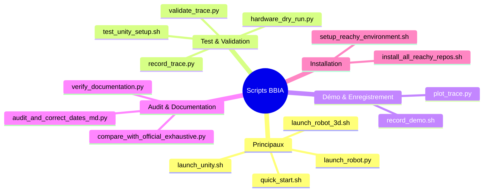
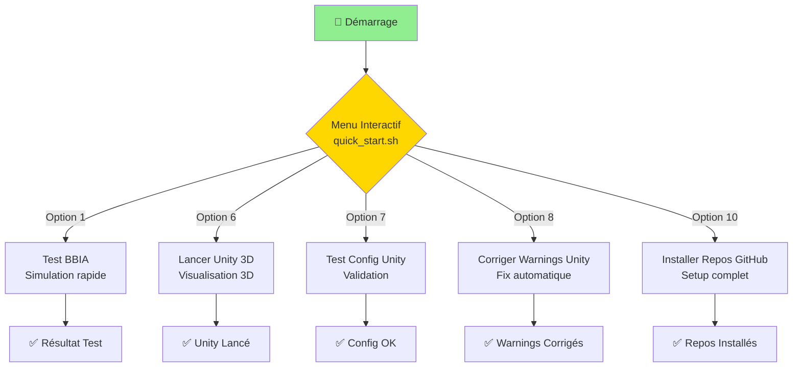

# 🚀 Scripts BBIA

> **Scripts d'automatisation pour BBIA - Brain-Based Interactive Agent**

**📚 [Documentation principale](../README.md)** | **📖 [Guide premiers pas](../docs/guides/GUIDE_DEMARRAGE.md)** | **🔧 [Guide avancé](../docs/guides/GUIDE_AVANCE.md)**

## 🎯 Vue d'Ensemble des Scripts



## ⚠️ **Scripts Dépréciés**

- ❌ **`start_api.py`** → Utiliser `start_public_api.py` (archivé dans `_archived/`)
- ❌ **`kill_greedy_processes.sh`** → Utiliser `cleanup_all.sh --ram-only` (archivé dans `_archived/`)
- ⚠️ **`kill_mujoco_viewers.sh`** → Utiliser `process_manager.py stop` (déprécié mais gardé)
- ⚠️ **`cleanup_project.sh`** → Utiliser `cleanup_all.sh` (script fusionné)
- ⚠️ **`cleanup_metadata_files.sh`** → Utiliser `cleanup_all.sh` (script fusionné)
- ⚠️ **`smart_process_cleanup.sh`** → Utiliser `cleanup_all.sh --ram-only` (script fusionné)

### 🔄 **Scripts d'Audit Consolidés** (Oct / Nov. 2025)

Les scripts de comparaison/audit avec le SDK officiel Reachy Mini ont été consolidés :

- ✅ **`compare_with_official_exhaustive.py`** → Script principal (amélioré avec fusions)
- ✅ **`check_official_alignment.py`** → Alignement MJCF/STL (conservé)
- ✅ **`generate_conformity_report_reachy_mini.py`** → Génération rapports (conservé)

**Scripts archivés** dans `scripts/_archived/comparison_audit/` :

- 8 scripts redondants ou obsolètes (voir `scripts/_archived/comparison_audit/README.md`)

### 📝 **Scripts Documentation Consolidés** (Oct / Nov. 2025)

- ✅ **`audit_and_correct_dates_md.py`** → Script unifié pour audit et correction des dates MD
  - Fusion de : `audit_dates_md.py`, `audit_md_dates.py`, `correct_dates_md.py`, `correct_dates_md_final.py`
  - Usage : `python scripts/audit_and_correct_dates_md.py [--audit-only|--correct]`

- ✅ **`verify_documentation.py`** → Script unifié pour vérification documentation
  - Fusion de : `verify_doc_accuracy.py`, `verify_md_vs_code.py`
  - Usage : `python scripts/verify_documentation.py [--accuracy|--consistency]`

**Scripts archivés** dans `scripts/_archived/dates_md/` et `scripts/_archived/verification/` :

- Voir `scripts/_archived/dates_md/README.md` et `scripts/_archived/verification/README.md`

Voir `scripts/_archived/README.md`, `scripts/PLAN_CONSOLIDATION_AUDIT_SCRIPTS.md` et `scripts/PLAN_FUSION_SCRIPTS.md` pour plus de détails.

## 🎯 **Scripts Disponibles**

### 🎮 **Scripts Principaux**

- **`quick_start.sh`** - Menu interactif principal
- **`launch_unity.sh`** - Lancement de la simulation Unity 3D
- **`launch_robot_3d.sh`** - Lancement du robot Reachy Mini en 3D
- **`launch_robot.py`** - Script Python pour lancer le robot
- **`install_all_reachy_repos.sh`** - Installation automatique des dépôts GitHub
- **`setup_reachy_environment.sh`** - Configuration de l'environnement

### 🧪 **Scripts de Test**

- **`test_unity_setup.sh`** - Test de la configuration Unity
- **`fix_unity_warnings.sh`** - Correction des avertissements Unity
- **`hardware_dry_run.py`** - Validation hardware Reachy réel ✅
- **`record_trace.py`** - Enregistrement traces golden
- **`validate_trace.py`** - Validation traces contre référence

### ✅ **Scripts de Vérification Documentation**

- **`verify_docs_complete.py`** ⭐ - Vérification complète documentation (liens, Mermaid, orthographe, formatage, cohérence code) - **RECOMMANDÉ**
- **`verify_documentation.py`** - Vérification précision, cohérence et amélioration formatage MD (fusionné avec `audit_and_improve_md.py`)
  - Modes: `--accuracy`, `--consistency`, `--improve`
- **`audit_and_correct_dates_md.py`** - Audit et correction dates MD (bien consolidé)

### 🎬 **Scripts de Démo (NOUVEAUX)**

- **`record_demo.sh`** - Enregistrement démo complète ✅
- **`plot_trace.py`** - Génération rapports d'analyse ✅

### 🧹 **Scripts de Nettoyage (FUSIONNÉS)**

- **`cleanup_all.sh`** ⭐ - Script fusionné de nettoyage complet (RECOMMANDÉ)
  - Fusionne : `cleanup_project.sh`, `cleanup_metadata_files.sh`, `smart_process_cleanup.sh`
  - Nettoie fichiers cache (Python, mypy, pytest, ruff) ET libère la RAM
  - Usage :
    ```bash
    # Nettoyer uniquement les fichiers cache (par défaut)
    ./scripts/cleanup_all.sh
    
    # Nettoyer uniquement la RAM
    ./scripts/cleanup_all.sh --ram-only
    
    # Nettoyer tout automatiquement (sans confirmation)
    ./scripts/cleanup_all.sh --yes
    ```
  - Options : `--cache-only`, `--ram-only`, `--yes/-y`, `--help/-h`

- **`cleanup_project.sh`** - Nettoyage fichiers cache uniquement (déprécié, utiliser `cleanup_all.sh`)
- **`cleanup_metadata_files.sh`** - Nettoyage métadonnées macOS uniquement (déprécié, utiliser `cleanup_all.sh`)
- **`smart_process_cleanup.sh`** - Nettoyage RAM uniquement (déprécié, utiliser `cleanup_all.sh --ram-only`)

---

## 🚀 **Utilisation Rapide**

### Workflow Principal



### 🎮 **Menu Interactif (Recommandé)**

```bash
./scripts/quick_start.sh
```

**Options disponibles :**

- Option 1 : Tester BBIA (simulation rapide)
- Option 6 : Lancer Unity 3D
- Option 7 : Tester la configuration Unity
- Option 8 : Corriger les avertissements Unity
- Option 10 : Installer dépôts GitHub

### 🧪 **Scripts de Validation**

#### **Hardware Dry Run**

```bash
# Test hardware complet (10s)
python scripts/hardware_dry_run.py --duration 10

# Test joint spécifique
python scripts/hardware_dry_run.py --joint yaw_body --duration 5
```

**Résultat attendu** :

```text
✅ Robot Reachy connecté avec succès
✅ Tous les joints de test sont disponibles
✅ Limite d'amplitude respectée
✅ Joint interdit correctement rejeté
⏱️ Latence moyenne: 0.0ms
✅ Latence cible atteinte (<40ms)
Hardware dry run réussi.
```

#### **Scripts de Démo**

```bash
# Enregistrer une démo complète
bash scripts/record_demo.sh happy 15

# Générer un rapport d'analyse
python scripts/plot_trace.py --input assets/videos/demo_happy_*.jsonl --output assets/plots/rapport.txt
```

#### **Golden Tests**

```bash
# Enregistrer une trace de référence
python scripts/record_trace.py --emotion happy --duration 5 --out artifacts/golden/happy_mujoco.jsonl

# Valider une trace contre référence
python scripts/validate_trace.py --ref artifacts/golden/happy_mujoco.jsonl --cur current_trace.jsonl
```

**Résultat attendu** :

```text
✅ Validation réussie
📊 Métriques:
   • Max abs qpos err: 0.1234
   • Ref hz: 60.0
   • Cur hz: 59.8
   • Diff rate percent: 0.3
   • Frames compared: 300
```

### 🤖 **Lancement Robot 3D**

```bash
# Script bash (recommandé)
./scripts/launch_robot_3d.sh

# Script Python
python scripts/launch_robot.py
```

**Fonctionnalités :**

- Robot Reachy Mini complet en 3D
- Mode graphique et headless
- Détection automatique macOS/Linux
- Test rapide disponible

### 🎯 **Lancement Unity**

```bash
./scripts/launch_unity.sh
```

**Fonctionnalités :**

- Détection automatique du projet Unity
- Lancement via Unity Hub
- Gestion des erreurs

### 📚 **Installation Dépôts**

```bash
./scripts/install_all_reachy_repos.sh
```

**Dépôts installés :**

- reachy-docs
- pollen-vision
- reachy2-tutorials
- reachy-dashboard
- reachy-face-tracking
- reachy2-behaviors-dev
- reachy2-sdk-audio-server-rs
- reachy-unity-package

### 🔧 **Configuration Environnement**

```bash
./scripts/setup_reachy_environment.sh
```

**Configuration :**

- Installation des dépendances Python
- Configuration de l'environnement virtuel
- Vérification des installations

---

## 🧪 **Tests et Dépannage**

### 🔍 **Test Unity**

```bash
./scripts/test_unity_setup.sh
```

**Vérifications :**

- Présence d'Unity Hub
- Configuration du projet Unity
- Permissions des fichiers

### 🔧 **Correction Avertissements**

```bash
./scripts/fix_unity_warnings.sh
```

**Corrections :**

- Mise à jour des packages Unity
- Correction des conflits de versions
- Optimisation des paramètres

---

## 📁 **Structure des Scripts**

```text
scripts/
├── 🎮 quick_start.sh                              # Menu interactif principal
├── 🎯 launch_unity.sh                             # Lancement Unity 3D
├── 📚 install_all_reachy_repos.sh                # Installation dépôts GitHub
├── 🔧 setup_reachy_environment.sh                # Configuration environnement
├── 🧪 test_unity_setup.sh                        # Test configuration Unity
├── 🔧 fix_unity_warnings.sh                      # Correction avertissements Unity
├── 🔍 compare_with_official_exhaustive.py        # Comparaison exhaustive BBIA vs SDK officiel ✅
├── 🔍 check_official_alignment.py                # Vérification alignement MJCF/STL ✅
├── 📊 generate_conformity_report_reachy_mini.py   # Génération rapports conformité ✅
├── _archived/
│   ├── comparison_audit/                        # Scripts d'audit archivés (8 scripts)
│   └── start_api.py                              # Script API obsolète
└── 📖 README.md                                  # Ce fichier
```

---

## 🎯 **Détails des Scripts**

### 🎮 **quick_start.sh**

**Fonction :** Menu interactif principal avec toutes les options
**Utilisation :** Point d'entrée principal pour BBIA
**Options :** 10 options différentes pour toutes les fonctionnalités

### 🎯 **launch_unity.sh**

**Fonction :** Lancement de la simulation Unity 3D
**Détection :** Automatique du dossier `reachy-bbia-unity`
**Lancement :** Via Unity Hub avec gestion d'erreurs

### 📚 **install_all_reachy_repos.sh**

**Fonction :** Installation automatique de tous les dépôts GitHub
**Dépôts :** 8 dépôts officiels de Pollen Robotics
**Vérification :** Test automatique après installation

### 🔧 **setup_reachy_environment.sh**

**Fonction :** Configuration complète de l'environnement
**Dépendances :** Installation des packages Python
**Vérification :** Test de l'installation

### 🧪 **test_unity_setup.sh**

**Fonction :** Test de la configuration Unity
**Vérifications :** Unity Hub, projet, permissions
**Rapport :** État détaillé de la configuration

### 🔧 **fix_unity_warnings.sh**

**Fonction :** Correction des avertissements Unity
**Corrections :** Packages, versions, paramètres
**Optimisation :** Performance et stabilité

---

## 🎯 **Commandes Rapides**

### 🚀 **Démarrage Immédiat**

```bash
# Menu interactif
./scripts/quick_start.sh

# Unity 3D
./scripts/launch_unity.sh

# Installation complète
./scripts/install_all_reachy_repos.sh
```

### 🔍 **Tests et Vérifications**

```bash
# Test Unity
./scripts/test_unity_setup.sh

# Correction avertissements
./scripts/fix_unity_warnings.sh

# Configuration environnement
./scripts/setup_reachy_environment.sh
```

---

## 💡 **Conseils d'Utilisation**

1. **Commencez par le menu** : `./scripts/quick_start.sh`
2. **Utilisez Unity** : `./scripts/launch_unity.sh`
3. **Installez les dépôts** : `./scripts/install_all_reachy_repos.sh`
4. **Testez la configuration** : `./scripts/test_unity_setup.sh`
5. **Corrigez les problèmes** : `./scripts/fix_unity_warnings.sh`

---

## 🎯 **Dépannage**

### ❌ **Problèmes Courants**

- **Permission denied** : `chmod +x scripts/*.sh`
- **Unity non trouvé** : Vérifiez l'installation d'Unity Hub
- **Dépôts non installés** : Lancez `install_all_reachy_repos.sh`
- **Erreurs Python** : Lancez `setup_reachy_environment.sh`

### ✅ **Solutions**

- **Tous les scripts** sont testés et fonctionnels
- **Gestion d'erreurs** intégrée dans chaque script
- **Vérifications automatiques** après chaque installation
- **Documentation** complète pour chaque script

---

**BBIA** - Brain-Based Interactive Agent  
*Scripts d'automatisation* 🚀✨

## 📊 **Résumé des Scripts** (Nov. 2025)

- **✅ Scripts utiles** : ~35 scripts actifs et maintenus
- **❌ Scripts inutiles** : 2 scripts déjà archivés (`start_api.py`, `kill_greedy_processes.sh`)
- **⚠️ Scripts à améliorer** : ~5 scripts à consolider (audit, documentation)
- **🚀 Scripts prioritaires** : ~10 scripts essentiels (quick_start.sh, launch_complete_robot.py, start_public_api.py, etc.)

### 🎯 **Scripts Prioritaires**

**Immédiat :**
1. `quick_start.sh` - Point d'entrée principal
2. `launch_complete_robot.py` - Lanceur robot complet
3. `start_public_api.py` - API robuste

**Maintenance :**
1. `verify_docs_complete.py` - Vérification documentation
2. `hardware_dry_run_reachy_mini.py` - Tests hardware Reachy Mini
3. `smart_process_cleanup.sh` - Nettoyage processus sécurisé

**Développement :**
1. `dashboard_gradio.py` - Interface moderne
2. `record_demo.sh` - Enregistrement démos
3. `plot_trace.py` - Analyse traces

---

**Version** : 2.1  
**Date** : Nov. 2025  
**Scripts** : ✅ ~35 scripts fonctionnels  
**Automatisation** : ✅ Complète
