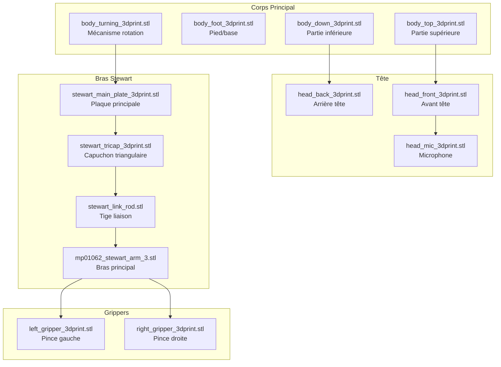
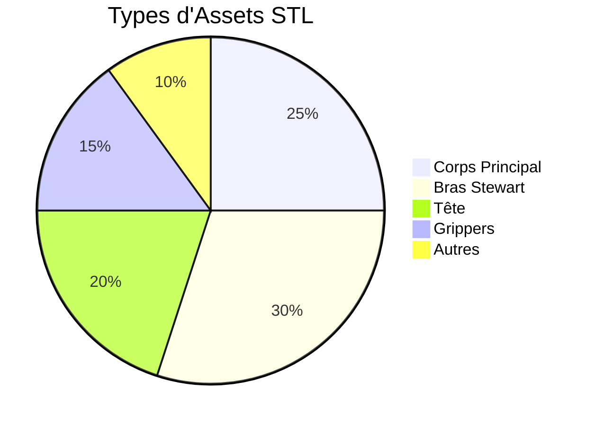

# Assets Officiels Reachy Mini

Ce dossier contient les modèles 3D officiels de Reachy Mini, récupérés du dépôt officiel Pollen Robotics.

## Source

- **Dépôt officiel** : https://github.com/pollen-robotics/reachy_mini
- **Version** : v1.0.0rc5 (21 novembre 2025)
- **Chemin source** : `src/reachy_mini/descriptions/reachy_mini/mjcf/assets/`

# 🎨 Assets Officiels Reachy Mini

Ce dossier contient les modèles 3D officiels de Reachy Mini, récupérés du dépôt officiel Pollen Robotics.

## 🏗️ Architecture des Assets

## 📊 Répartition des Assets

## Mapping vers bbia-sim

### Correspondances avec les anciens assets

- **Torso** → `body_top_3dprint.stl` + `body_down_3dprint.stl`
- **Head** → `head_front_3dprint.stl` + `head_back_3dprint.stl`
- **Upper Arm** → `mp01062_stewart_arm_3.stl`
- **Forearm** → `stewart_link_rod.stl`
- **Gripper** → `stewart_tricap_3dprint.stl`

### Notes d'Intégration

- Les assets officiels sont plus détaillés et réalistes
- La structure Stewart (plateforme parallèle) est maintenant correctement représentée
- Les fichiers `.part` correspondants sont disponibles dans le dépôt officiel si besoin

## Utilisation

Ces assets sont référencés dans le fichier MJCF `src/bbia_sim/sim/models/reachy_mini.xml` et utilisés par le simulateur MuJoCo pour le rendu 3D.

## Maintenance

- Vérifier périodiquement les mises à jour du dépôt officiel
- Maintenir la cohérence entre les références MJCF et les fichiers STL
- Documenter tout changement de structure ou de nommage
